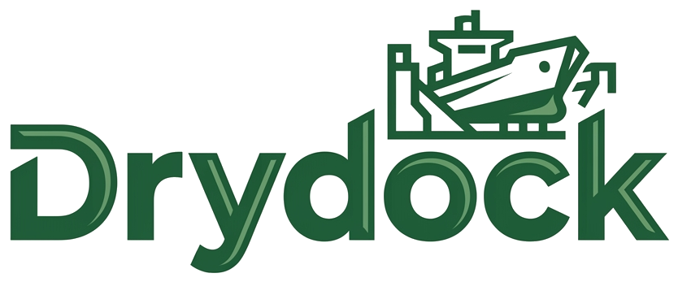
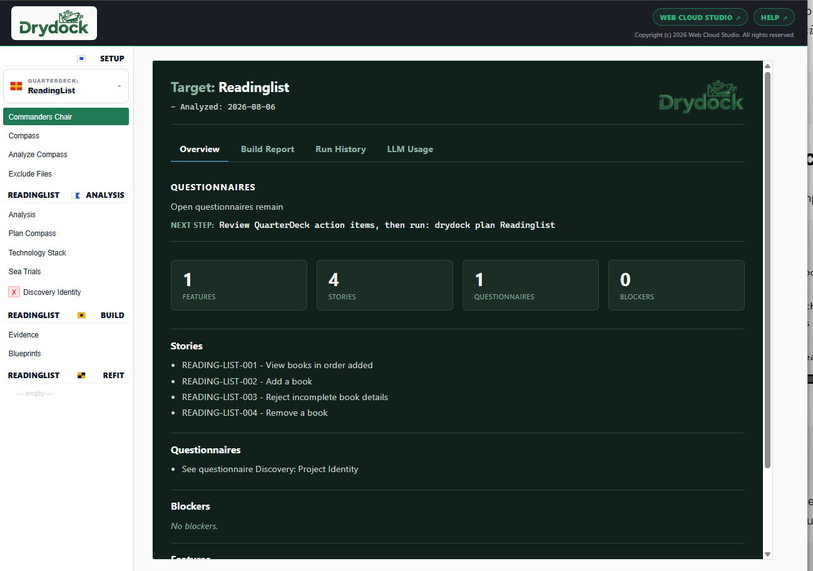

<div align="center">



**Drydock turns specifications into tested working software.**

Specification driven. Agile. Test driven. Dependency-aware builds. Dedicated web console.
Enterprise guardrails.

**No API keys — Drydock runs on your existing Claude or Codex subscription.**

[](https://pypi.org/project/drydock-sdd/)
[](https://pypi.org/project/drydock-sdd/)
[](LICENSE)

### ▶ START HERE — [Quick Start](https://webcloudstudio.com/project-docs/drydock/QUICK_START.html)

[Specification](https://webcloudstudio.com/project-docs/drydock/index_sections/introduction.html) · [Installation](https://webcloudstudio.com/project-docs/drydock/USER_INSTALLATION.pdf) · [Comparison matrix](https://webcloudstudio.com/project-docs/drydock/papers/Product_Comparison_Matrix.html) · [Overview deck](https://webcloudstudio.com/drydock/) · [Contributing](CONTRIBUTING.md)

</div>

---

## Overview

**Drydock turns messy specifications into tested working software.**
**A repeatable method to build from the specification and evolve with it.**

Drydock imports your source material, creates stories using agile best practices, decomposes your sources into typed blueprints (stories) related using a graph database.  Drydock will run context aware builds.  Each story has deterministic test driven acceptance criteria.

- **Specification Driven Delivery** producing governed reproducible working software.
- **Agile Methedology** to decompose buildable stories and for product owner / llm review.
- **Test driven development** with acceptance criteria embedded in each Story/Blueprint.
- **Dependency graph of stories** in `MANIFEST.md` to relates nodes/stories and order builds.
- **Context compression** and **Grouping** for context aware builds.
- **QuarterDeck web console** for easy questionaires, observability, and user direction.
- **Enterprise guardrails** with embedded branding, best practices, and build gates

## Drydock Documentation

| Resource | PDF |
|---|---|
| [Quick Start](https://webcloudstudio.com/project-docs/drydock/QUICK_START.html) | [PDF](https://webcloudstudio.com/project-docs/drydock/QUICK_START.pdf) |
| [User Installation Guide](https://webcloudstudio.com/project-docs/drydock/USER_INSTALLATION.pdf) ||
| [Drydock Specification](https://webcloudstudio.com/project-docs/drydock/index_sections/introduction.html) | [PDF](https://webcloudstudio.com/project-docs/drydock/Drydock_Specification.pdf) |
| [CHANGELOG.md](CHANGELOG.md) | — |
| [CONTRIBUTING.md](CONTRIBUTING.md) | — |

## Getting started

**Prerequisites**

- [ ] Python 3.11 or later — `python3 --version`
- [ ] Install `uv`
  - `curl -LsSf https://astral.sh/uv/install.sh | sh` (macOS/Linux),
  - `brew install uv`
  - `winget install --id=astral-sh.uv -e` (Windows)
- [ ] `claude` or `codex` CLI, authenticated, in your `PATH` (claude --version, codex --version)

**Install Drydock**

```bash
uv tool install drydock-sdd     # or: pipx install drydock-sdd
drydock --version
```

**Configure Drydock**

```bash
export PROJECTS="$HOME/projects" # main directory you keep your code/projects/git
mkdir -p "$PROJECTS/drydock"     # the drydock workspace

drydock config set llm_provider claude          # or codex
drydock config set drydock_model sonnet         # or gpt-5.4 or other models
drydock config set drydock_workspace "$PROJECTS/drydock"
drydock config set drydock_build_directory "$PROJECTS"
drydock config show
```

Bounds on a build's acceptance runs are configurable, and each is also a `drydock build` and
`drydock uat` flag that overrides the configured value for one run.

| Key | Default | Bounds |
|---|---|---|
| `repair_attempts` | 6 | Repair passes a failed block may spend (0 disables repair) |
| `repair_stall_limit` | 2 | Consecutive passes without acceptance progress before a block stops |
| `sandbox_mem_limit` | 4096 MB | Address space for an acceptance run and everything it spawns |
| `capture_output_limit` | 8 MB | Output held from one acceptance command before it fails the gate |

```bash
drydock config set repair_attempts 12           # a target that converges slowly
drydock build MyApp --capture-output-limit 64   # a legitimately loud conformance suite
```
## Build workflow

`init` → `import` → `analyze` → `plan` → `build` → `refit` → `build`

| Stage | Command | What it does |
|---|---|---|
| **init** | `drydock init <Target>` | Initialize Workspace<br>**Creates:** `targets/<Target>` |
| **import** | `drydock import <Target>` | import source material<br>**Creates:** `targets/<Target>/sources` |
| **analyze** | `drydock analyze <Target>` | Decompose into stories, acceptance criteria, questions, and blockers.<br>**Creates:** `ANALYSIS.md`, `SEA_TRIALS.md`, `BLOCKERS.md`, questionnaires. |
| **plan** | `drydock plan <Target>` | Create story blueprints and a graph datbase.<br>**Creates:** `blueprints/` and `MANIFEST.md`. |
| **build** | `drydock build <Target>` | Executes context-aware builds gated by deterministic acceptance criteria.<br>**Creates:** `\$drydock_build_directory/<Target>` with working software. |
| **refit** | `drydock refit <Target>` | git diff changes into change tickets and Manifest nodes.<br>**Updates:** `Blueprints/`, `MANIFEST.md`; continue with a  `build`. |

## The Drydock CLI

`ai` calls your subscription CLI agent; all other commands are deterministic.

```text
# ── S ── SET UP ──────────────────────────────────────────────────────────
    drydock config show                        # Show configuration values and sources
    drydock config set        <var> <value>    # Set a configuration value
    drydock init              MyApp            # Create the target workspace
    drydock status                             # Status dashboard
    drydock status            MyApp            # Summary and plan state

# ── A ── ANALYZE ─────────────────────────────────────────────────────────
    drydock import            MyApp <file|dir> # Import sources into the workspace
ai  drydock analyze           MyApp            # Epic decomposition into stories & blockers
    drydock validate          MyApp            # Validate Build Plan
ai  drydock score spec        MyApp            # Audit imported raw specifications
    drydock run quarterdeck   MyApp            # Web interface
ai  drydock plan              MyApp            # Grooming and dependency graph

# ── I ── IMPLEMENT ───────────────────────────────────────────────────────
ai  drydock build             MyApp            # Iterative context-aware process
ai  drydock score release     MyApp            # Score project success criteria (EARS)

# ── L ── LOOP ────────────────────────────────────────────────────────────
ai  drydock refit             MyApp            # Diff -> ticket -> dependency graph
```

### Additional Commands

```text
    drydock build status      MyApp            # Show build state
    drydock build verify      MyApp <step>     # Display/Verify build graph
ai  drydock build score       MyApp            # Generate SCORECARD.md
ai  drydock uat               [Project]        # Scored UAT testing
    drydock uat --report      [run]            # Rebuild a run's HTML proof kit
ai  drydock document          MyApp            # Project documentation automation
ai  drydock document generate MyApp            # AI pass only
    drydock document assemble MyApp            # Assembly only
    drydock publish           <Source.md>      # Render Markdown to HTML/PDF
ai  drydock rigging compact                    # Automanage compaction
    drydock rigging verify                     # Verify rigging compliance
    drydock score ac          MyApp            # Verify Story acceptance criteria
    drydock score build       MyApp            # Post-build report: repairs, tokens, cache
    drydock score report      MyApp            # Publish the build receipt with its evidence
ai  drydock score drydock                      # Adversarial self-assessment
```

Each selected `uat/<Project>/` directory is an independent Git repository. `drydock uat`, resume
stages, and `drydock uat --report` initialize it when absent and commit all kit changes before exit.

## The QuarterDeck Web Server

QuarterDeck is the Agile web surface between the Commander (product owner) and Crew (LLM agents).

```bash
drydock run quarterdeck <Target>
```



## Glossary

| Term | Meaning |
|---|---|
| **Target** | One project managed by Drydock, held in its own workspace directory. |
| **Blueprint** | The typed specification for one story: scope, contracts, and acceptance criteria. |
| **Manifest** | `MANIFEST.md`, the dependency graph that relates and orders the Blueprints. |
| **Sea Trials** | Product-level objectives and proof-of-delivery criteria — the release gate. |
| **Soundings** | The per-story acceptance-criterion verification board. |
| **Scorecard** | `SCORECARD.md`, the recorded release scoring results, verdicts, and blockers. |
| **QuarterDeck** | The web console used to review and direct each phase. |
| **Commander** | You — the product owner who approves the work. |
| **Crew** | The LLM agents that perform the work. |

## Contributing

Help test Drydock on real projects. Open [issues](https://github.com/webcloudstudio/Drydock/issues). See [CONTRIBUTING.md](CONTRIBUTING.md).

## License (See LICENSE)

```
MIT License

Copyright (c) 2026 Web Cloud Studio

Permission is hereby granted, free of charge, to any person obtaining a copy
of this software and associated documentation files (the "Software"), to deal
in the Software without restriction, including without limitation the rights
to use, copy, modify, merge, publish, distribute, sublicense, and/or sell
copies of the Software, and to permit persons to whom the Software is
furnished to do so, subject to the following conditions:

The above copyright notice and this permission notice shall be included in all
copies or substantial portions of the Software.

THE SOFTWARE IS PROVIDED "AS IS", WITHOUT WARRANTY OF ANY KIND, EXPRESS OR
IMPLIED, INCLUDING BUT NOT LIMITED TO THE WARRANTIES OF MERCHANTABILITY,
FITNESS FOR A PARTICULAR PURPOSE AND NONINFRINGEMENT. IN NO EVENT SHALL THE
AUTHORS OR COPYRIGHT HOLDERS BE LIABLE FOR ANY CLAIM, DAMAGES OR OTHER
LIABILITY, WHETHER IN AN ACTION OF CONTRACT, TORT OR OTHERWISE, ARISING FROM,
OUT OF OR IN CONNECTION WITH THE SOFTWARE OR THE USE OR OTHER DEALINGS IN THE
SOFTWARE.
```
