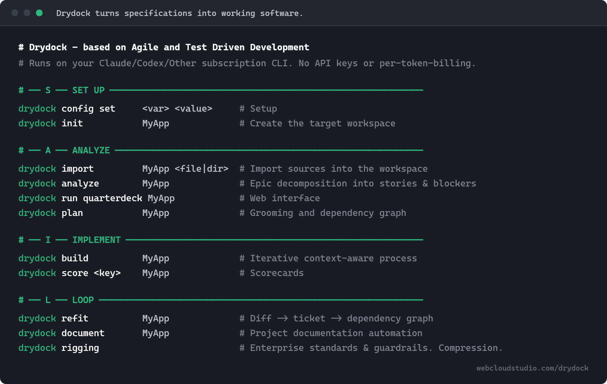

<div align="center">


# Drydock

**Your coding agent forgets. Drydock does not.**

Drydock turns a written description of a software project into typed specifications,
builds the software from those specifications with your Claude or Codex subscription,
and records what happened.

It keeps the specifications, build order, decisions, tests, and build results together
so the software can be reviewed, rebuilt, and changed cleanly.

[](https://pypi.org/project/drydock-sdd/)
[](https://pypi.org/project/drydock-sdd/)
[](LICENSE)
[](https://github.com/webcloudstudio/Drydock/actions/workflows/ci.yml)

[Quick Start](docs/QUICK_START.md) · [Install and set up](#install-and-set-up) · [How Drydock works](#how-drydock-works) · [Why It Is Different](#why-it-is-different) · [Canonical Specification](https://webcloudstudio.com/project-docs/drydock/)
[Overview Deck](https://webcloudstudio.com/drydock/) · [White Paper](https://zenodo.org/records/21287574) · [10 Minute Overview](https://webcloudstudio.com/project-docs/drydock/presentation/Drydock_Video.web.mp4) · [User Installation Guide](https://github.com/webcloudstudio/Drydock/blob/main/docs/USER_INSTALLATION.md)

</div>

---

```bash
uv tool install drydock-sdd
```

Drydock uses your existing Claude or Codex subscription CLI. It does not require
API keys or per-token API billing.

Copyright (c) 2026 Web Cloud Studio. Licensed under the MIT License. See [LICENSE](LICENSE).

## How Drydock works

Drydock follows five steps:

1. Set up a workspace.
2. Import your project notes.
3. Review the specifications and build graph.
4. Build working software.
5. Change and maintain your working software.

The Blueprint contains the typed specifications that define the product. The Manifest,
stored in `MANIFEST.md`, is the executable build graph. It connects the Blueprint stories,
tracks their dependencies, selects the work that can run next, and gives each build the
context it needs.

<div align="center">

</div>

## What Drydock Is

Drydock is an installable Python command-line package. The PyPI distribution is
`drydock-sdd`; the installed command is `drydock`.

The core idea is simple: reproducible LLM builds require a process. Drydock uses
Agile structure, explicit product-owner review, durable evidence, and context-managed
build prompts so generated software can be inspected, repeated, and iterated.

## Install and set up

Python 3.11 or later is required.

```bash
uv tool install drydock-sdd
drydock --version
drydock --help
```

Drydock needs one provider CLI for commands that analyze, plan, or build software.
Install and sign in to one of these before using those commands:

- `claude`
- `codex`

Select the provider:

```bash
drydock config set llm_provider claude
# or
drydock config set llm_provider codex
```

Choose a workspace directory and configure it:

```bash
mkdir -p "$HOME/drydock"

drydock config set drydock_workspace "$HOME/drydock"
drydock config show
```

The workspace holds your projects and Drydock's records. The default build location is:

```text
$HOME/drydock/build/<Target>/
```

You can change the build location later if needed:

```bash
drydock config set drydock_build_directory "$HOME/projects"
```

PDF publishing is optional:

```bash
uv tool install "drydock-sdd[pdf]"
playwright install chromium
```

### Workspace skills

`drydock init` provisions Drydock's shipped workspace skills into both
`.claude/skills/` and `.agents/skills/` in the configured workspace. The Loop skills include
`/refit`, which captures a design discussion in the Target, and
`/apply-refit`, which turns approved decisions into change tickets. See
[Drydock skills](https://github.com/webcloudstudio/Drydock/tree/main/Rigging/skills)
for usage.

## Quick start

The examples below use `MyApp` as the project name. Replace `MyApp` with the name
of your own project when you run the commands.

Create the project workspace:

```bash
drydock init MyApp \
  --display-name "My App" \
  --description "A working software product."

drydock status
```

Import your project notes and create the Blueprint and Manifest:

```bash
drydock import MyApp ./notes --format markdown
drydock analyze MyApp
drydock run quarterdeck MyApp
drydock plan MyApp
drydock build status MyApp
```

Build working software and check it:

```bash
drydock build MyApp
drydock build status MyApp
drydock score ac MyApp
drydock score release MyApp
```

Change the Blueprint first. Then update the build graph and rebuild the affected work:

```bash
drydock refit MyApp
drydock build MyApp
drydock score ac MyApp
drydock document MyApp
```

Your project workspace is:

```text
$HOME/drydock/targets/MyApp/
```

The generated application is:

```text
$HOME/drydock/build/MyApp/
```

Run `drydock --help` for the complete command list.

## Why It Is Different

Drydock is not a prompt collection and it is not a one-shot code generator. It keeps
the typed specifications, executable build graph, review decisions, acceptance checks,
and execution evidence with the project.

That record makes each build reviewable, repeatable, and easier to change.

For how Drydock compares with other specification-driven tools, see the
[Product Comparison Matrix](docs/Product_Comparison_Matrix.md).

## Current Release Status

Drydock `0.1.5` is an alpha release. The primary SAIL path is implemented, but the
command surface and Typed Specification contracts remain unstable during the `0.x` series:

- Workspace configuration and Target initialization.
- Markdown, source tree, Spec Kit, and Compass import.
- LLM-assisted analysis with blockers, questionnaires, Soundings, Sea Trials, and
  Commander review artifacts.
- LLM-assisted planning into typed Blueprint files and `MANIFEST.md`.
- Manifest-frontier build execution, evidence capture, and human verification.
- Refit change-ticket conformance and applied-spec drift reconciliation.
- QuarterDeck runtime for review and process navigation.
- Rigging manifest registration, compaction, update, and verification.
- Target documentation generation and assembly.
- Deterministic Markdown publishing to HTML and optional PDF.
- Deterministic acceptance verification and release-gate evaluation.
- Advisory raw-specification conformance scoring before analysis.

`drydock score spec <Target>` inventories `blueprint/sources/`, extracts cited facts from every
Markdown source in bounded LLM passes, applies deterministic conformance rules, and writes
`SPECIFICATION_SCORECARD.md`. Non-Markdown sources are inventoried without content ingestion. The
assessment is advisory: findings do not gate `drydock analyze`.

Findings carry one of three severities, ranked by whether a build would fail on them. `Critical`
marks a violated guarantee of the scoring run itself. `Error` marks something a build would
probably fail on: a screen consuming a service nothing defines, a column declared for a table
nothing declares, a table with no columns, a CLI with no entry point, or two sources giving
contradictory instructions. `Warning` marks a defined thing nothing uses, or a refinement whose
absence still builds: a table never populated or never read, a missing help text, an unconsumed
event.

A specification is not faulted for leaving a consumer unstated, so a defined route or service that
nothing uses is not a finding at all. A relation the extraction never captured against any owner is
reported once as unobserved rather than charged against every owner. A column cited as
`table.column` belongs to its table. Audit, log, history, journal, and archive tables are exempt
from the unread-table warning.

`drydock score ac <Target>` deterministically verifies each Programmatic Acceptance assertion
and writes `SOUNDINGS.md`. `drydock score release <Target>` evaluates Sea Trials and writes
`SCORECARD.md`.

Programmatic Acceptance checks declare external tooling with repeated machine-readable lines such
as `Requires: python-package=httpx; scope=test`. Plan rejects visible undeclared imports and
subprocess executables. An unavailable requirement that is not already authorized becomes a
blocking, story-local Blueprint question; unrelated frontier stories remain buildable. Commander
answers are retained verbatim as durable Target guidance, including broad instructions such as
"approve all test harnesses". The QuarterDeck's **Approve for this Manifest** action remains a
current-Manifest authorization of the exact open request.

Build never improvises an undeclared acceptance dependency. A newly discovered package or
executable creates a build-origin blocking question, preserves partial work, and consumes no repair
attempt. Python/uv Target acceptance runs through the Target `.venv`; `uv sync --locked` provisions
only an authorized declared environment. Provisioning failure is an operational prerequisite
failure, not failed application acceptance.

`drydock score drydock` takes no Target. It runs an adversarial self-assessment of Drydock itself —
the specification, every prompt contract, and the command process — against Agile decomposition,
Test Driven Development, context economy, and governance, and writes ranked feature files with
Agile stories and TDD acceptance criteria to `docs/drydock_planning/`. It requires a source
checkout, recommends rather than changes anything, and defaults to the highest available model at
maximum reasoning effort. `--effort` selects the reasoning depth for the run.

The installed wheel includes Drydock's canonical product specification as a
read-only package resource at `drydock/resources/docs/Drydock_Specification.md`.

## Command Surface

Every command accepts the invocation-wide overrides `--model <model>`,
`--effort <low|medium|high|xhigh|max>`, and `--llm-provider <claude|codex>`. `--effort` selects
reasoning depth for the LLM-assisted commands; the level maps onto what the selected provider and
model serve. Precedence is `--effort`, then the prompt's declared effort, then `drydock_effort`,
then the provider's own default.

```text
drydock --help
drydock --version

drydock config show
drydock config set <key> <value>

drydock init <Target> [--display-name <name>] [--description <desc>]
drydock status [<Target>] [--check | --ready]
drydock validate <Target> [--verbose]
drydock run quarterdeck [<Target>] [--host HOST] [--port PORT]

drydock import <Target> <Source> [--format <auto|markdown|source|speckit|compass|intent>] [--force]
drydock analyze <Target> [--model <model>] [--llm-provider <claude|codex>]
drydock plan [--overwrite] [--no-conform] [--continue-attempts <n>] <Target> [--model <model>] [--llm-provider <claude|codex>]

drydock build <Target> [--step <step-id>] [--ungate] [--force] [--build-dir <path>] [--reset-failed] [--normalize-order] [--dry-run] [--show-prompt]
drydock build status <Target>
drydock score spec <Target>
drydock score ac <Target>
drydock score release <Target>
drydock score drydock [--model <model>] [--llm-provider <claude|codex>]

drydock rigging compact [<Target>] [--all] [--force] [--include-file <file.md>] [--exclude-file <file.md>] [--include-dir <dir>]
drydock rigging update <Target> [--dry-run]
drydock rigging verify <Target>

drydock document generate <Target> [--model <model>]
drydock document assemble <Target> [--theme <theme>]
drydock document assemble readme <Target>
drydock document <Target> [--model <model>] [--theme <theme>]

drydock publish <Source.md> --output <Output.html> [--theme <theme>] [--flatten] [--pdf] [--pdf-output <Output.pdf>]
```

Configuration keys:

| Key | Environment override | Purpose |
|---|---|---|
| `drydock_workspace` | `DRYDOCK_WORKSPACE` | Workspace containing `targets/` and Drydock logs |
| `drydock_build_directory` | `DRYDOCK_BUILD_DIRECTORY` | Root where generated applications are written |
| `drydock_model` | `DRYDOCK_MODEL` | Default model for LLM-assisted commands |
| `drydock_effort` | `DRYDOCK_EFFORT` | Default reasoning effort: `low`, `medium`, `high`, `xhigh`, `max`; unset keeps the provider default |
| `llm_provider` | `LLM_PROVIDER` | Subscription CLI provider: `claude` or `codex` |
| `prompt_warn_tokens` | `PROMPT_WARN_TOKENS` | Prompt-size warning threshold in tokens |
| `quarterdeck_port` | `QUARTERDECK_PORT` | Default QuarterDeck port |
| `diagnose` | `DRYDOCK_DIAGNOSE` | Standoff diagnosis of opaque failures; `--no-diagnose` suppresses it for one run |

## Public Documentation

Public hub and launch materials:

- [Web Cloud Studio](https://webcloudstudio.com)
- [Drydock GitHub repository](https://github.com/webcloudstudio/Drydock)
- [Canonical Drydock specification](https://webcloudstudio.com/project-docs/drydock/)
- [Launch deck and presentation](https://webcloudstudio.com/drydock/)
- [Launch video](https://webcloudstudio.com/project-docs/drydock/presentation/Drydock_Video.web.mp4)
- [Improving Step Accuracy in Specification-Driven Development](https://zenodo.org/records/21287574)

Repository references:

- [Install Drydock](https://github.com/webcloudstudio/Drydock/blob/main/docs/USER_INSTALLATION.md)
- [Drydock specification source](docs/Drydock_Specification.md)
- [Rendered specification HTML](docs/Drydock_Specification.html)
- [Rendered specification PDF](docs/Drydock_Specification.pdf)
- [Launch script](docs/presentation/script.md)
- [Talking points](docs/presentation/talking_points.md)

Development and governance:

- [Contributing](CONTRIBUTING.md)
- [Release process (maintainer runbook)](docs/RELEASE_PROCESS.md)
- [Drydock skills](https://github.com/webcloudstudio/Drydock/tree/main/Rigging/skills)
- [PyPI name reservation notes](docs/PYPI_NAME_RESERVATION.md)
- [Launch distribution plan](docs/presentation/distribution.md)

## Source Development

Install from a source checkout:

```bash
git clone https://github.com/webcloudstudio/Drydock.git
cd Drydock
uv venv
uv pip install -e ".[dev]"
```

Run local verification:

```bash
python -m pytest
ruff check src/ tests/
ruff format --check src/ tests/
```

Build release artifacts:

```bash
python -m hatchling build
```

After the editable install, run the installed console entry point against the source
tree:

```bash
drydock --help
```

## Security Model

Drydock assembles prompts deterministically and runs the selected provider CLI as a
subprocess. Execution evidence is persisted under Drydock logs so a run can be audited.

Provider handling is intentionally subscription-oriented:

- API-key environment variables are not the intended execution path.
- Claude and Codex are run through isolated command wrappers.
- Build commands operate against the configured Target workspace and generated application
  directory.
- Tests use injected runners and never require network or paid API access.

See the "Drydock Security" section in
[docs/Drydock_Specification.md](docs/Drydock_Specification.md#drydock-security) for the
current provider execution contracts.

## License

MIT - Copyright (c) 2026 Web Cloud Studio. See [LICENSE](LICENSE).

"Drydock" is a trademark of Web Cloud Studio; see [NOTICE](NOTICE) for use
of the name in forks and derivative works. See [CONTRIBUTORS.md](CONTRIBUTORS.md)
for the project's contributors.
