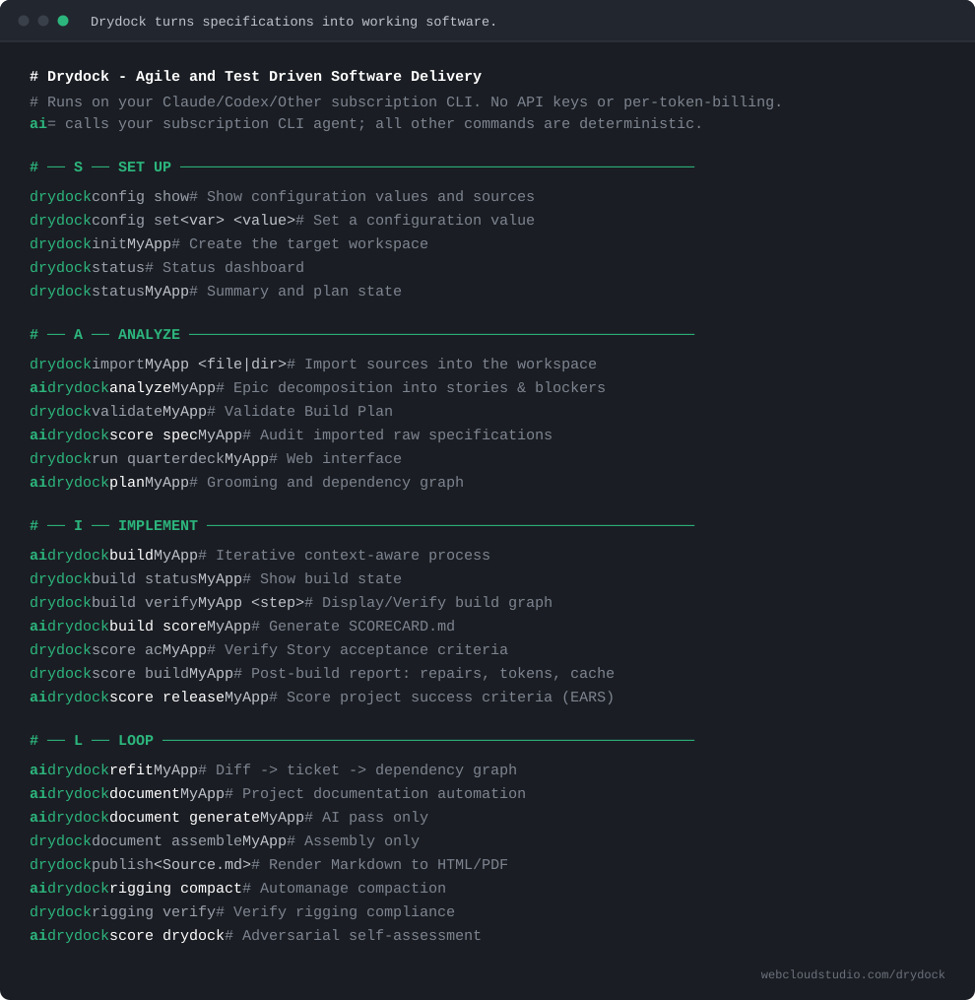

<div align="center">


# Drydock

**Drydock turns specifications into working software.**

Specification Driven Software Delivery. Agile. Test Driven. A dependency graph of stories.
Context compression. A web console. Enterprise guardrails on the subscription you already have.

[](https://pypi.org/project/drydock-sdd/)
[](https://pypi.org/project/drydock-sdd/)
[](LICENSE)
[](https://github.com/webcloudstudio/Drydock/actions/workflows/ci.yml)

### ▶ START HERE — [Quick Start](https://webcloudstudio.com/project-docs/drydock/QUICK_START.html)

[Specification](https://webcloudstudio.com/project-docs/drydock/index_sections/introduction.html) · [Installation](https://webcloudstudio.com/project-docs/drydock/USER_INSTALLATION.pdf) · [Comparison matrix](https://webcloudstudio.com/project-docs/drydock/papers/Product_Comparison_Matrix.html) · [Overview deck](https://webcloudstudio.com/drydock/) · [Contributing](CONTRIBUTING.md)

</div>

---

## What Drydock is

**Drydock turns specifications into working software.**

Drydock imports your source material using agile best practices into typed blueprints representing stories related with a graph database.  This enables drydock to context aware build your application.  Stories have measurable test driven acceptance criteria.

- **Specification driven.** Typed specifications are the source of truth. Code is the output.
- **Agile.** The specification is decomposed into features and stories, with product-owner review before the build starts.
- **Test driven.** Acceptance criteria are written into the blueprints.
- **A dependency graph of stories.** `MANIFEST.md` relates and orders the work and build.
- **Context compression and optimization.** Context aware builds let small models carry the load.
- **Web interface.** Guided dedicated web console
- **Enterprise guardrails.** Blocking questions instead of guesses, declared dependencies instead of improvised ones, and durable evidence for every step.
- **Change control.** Edit the specification; `drydock refit` writes a change ticket against each affected Blueprint and rebuilds only the work that moved.
- **Your subscription.** Runs on the `claude` or `codex` CLI. No API key, no per-token billing.

## Install

```bash
uv tool install drydock-sdd
```

Requires Python 3.11+ and one signed-in provider CLI, `claude` or `codex`.

Provider setup, workspace configuration, and troubleshooting are in the
**[User Installation Guide](https://webcloudstudio.com/project-docs/drydock/USER_INSTALLATION.pdf)**.

## The Drydock CLI

* `import` copies your specification material into a workspace.
* `analyze` decomposes the import into stories, acceptance criteria, questions, and blockers.
* `plan` grooms Blueprints, acceptance criteria, and the build graph.
* `build` creates software, testing each step.
* `refit` diffs updated specs into tickets.
* The `quarterdeck` web interface provides control and observability.

<div align="center">

</div>

The Target workspace is `<drydock_workspace>/targets/<Target>/`; the application is built in
`<drydock_build_directory>/<Target>/`. Run `drydock --help` for the full command list.

## Release status

**Alpha.** The methodology is complete and the full delivery path — import, analyze, plan, build,
score, refit, document — is implemented and in daily use. Current work is new project types and
sharper process guardrails.

Command surface and specification contracts still move during `0.x`. Pin your version and read
[CHANGELOG.md](CHANGELOG.md) before upgrading.

## Documentation

- [Quick Start](https://webcloudstudio.com/project-docs/drydock/QUICK_START.html) — build your first
  project ([PDF](https://webcloudstudio.com/project-docs/drydock/QUICK_START.pdf))
- [User Installation Guide](https://webcloudstudio.com/project-docs/drydock/USER_INSTALLATION.pdf)
- [Drydock Specification](https://webcloudstudio.com/project-docs/drydock/index_sections/introduction.html)
  — command, artifact, and process contracts
  ([single page](https://webcloudstudio.com/project-docs/drydock/Drydock_Specification.html) ·
  [PDF](https://webcloudstudio.com/project-docs/drydock/Drydock_Specification.pdf))
- [Overview deck](https://webcloudstudio.com/drydock/) ·
  [walkthrough video](https://webcloudstudio.com/project-docs/drydock/presentation/PRODUCTION_Drydock_Video.web.mp4)

Papers:

- [Improving Step Accuracy in Specification-Driven Development](https://webcloudstudio.com/project-docs/drydock/papers/Improving_Step_Accuracy_in_SDD.html)
- [Managing Changes in Specification-Driven Development](https://webcloudstudio.com/project-docs/drydock/papers/Managing_Changes_in_SDD.html)
- [Managing Changed Specifications](https://webcloudstudio.com/project-docs/drydock/papers/SDD_Managing_Changed_Specifications.html)
- [Product Comparison Matrix](https://webcloudstudio.com/project-docs/drydock/papers/Product_Comparison_Matrix.html)

## Contributing

Welcome aboard. The most useful contribution right now is a real project.

Build something you care about with Drydock and tell us where it broke: which specification
confused the planner, which build step needed a rescue, which evidence you wanted and could not
find. Open an [issue](https://github.com/webcloudstudio/Drydock/issues) with the Target, the
command, and what you expected. A failed build report is worth more than a compliment.

To work on Drydock itself, start with [CONTRIBUTING.md](CONTRIBUTING.md).

## Security

Drydock assembles prompts deterministically and runs the provider CLI as a subprocess through an
isolated wrapper. API keys are not the execution path, every run persists auditable evidence, and
tests never require network or paid API access. See
[Drydock Security](https://webcloudstudio.com/project-docs/drydock/index_sections/drydock-security.html).

## License

MIT — Copyright (c) 2026 Web Cloud Studio. See [LICENSE](LICENSE).

"Drydock" is a trademark of Web Cloud Studio; see [NOTICE](NOTICE) for use of the name in forks and
derivative works. See [CONTRIBUTORS.md](CONTRIBUTORS.md) for contributors.
