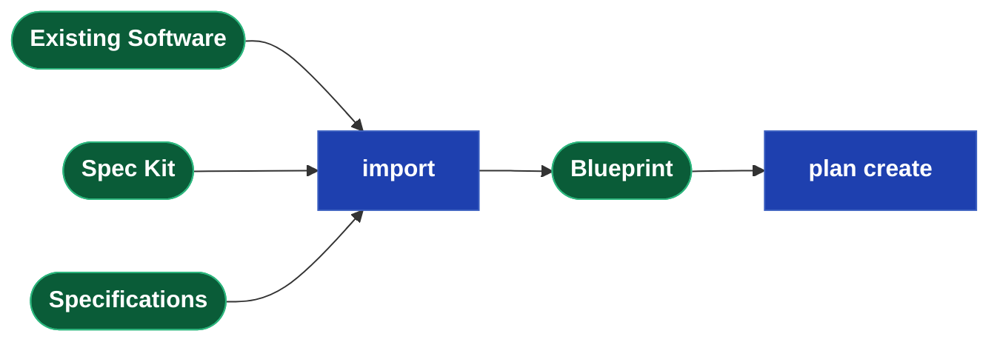
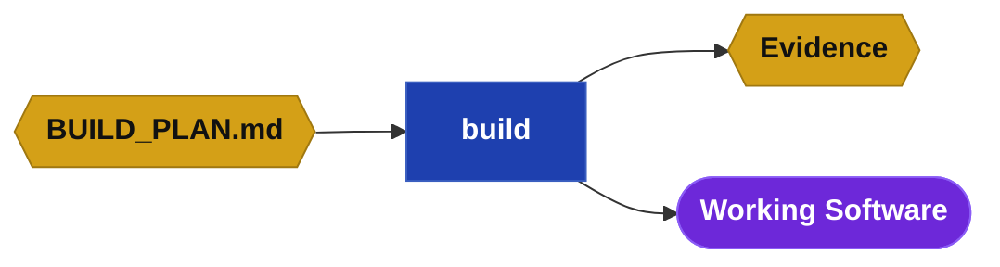
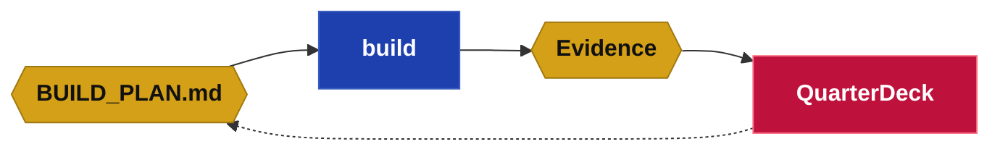
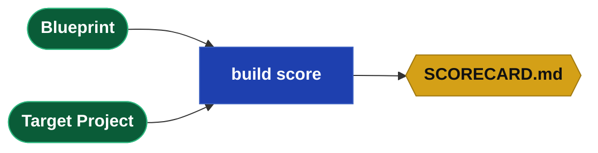
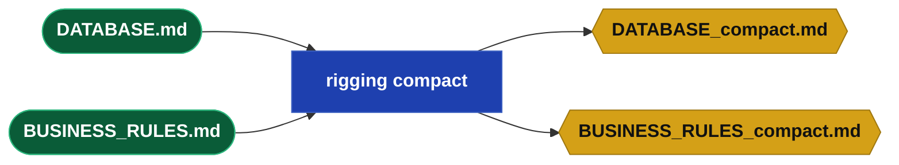

## Testimonials

> Drydock is a superset of Spec Kit by design. Every Spec Kit concept maps to a Drydock
> equivalent: research lives in spikes with evidence compiled into the QuarterDeck, task breakdown
> and clarification are first-class plan objects reviewed interactively, and governance is enforced
> by the Rigging across every project in the portfolio. Drydock then adds what Spec Kit does not
> attempt: governed build execution with staleness-driven incremental rebuilds, evidence-gated
> review through a generated throwaway console, an append-only decision ledger, the iterate loop,
> and documentation generation. Two honest caveats: Spec Kit ships integrations for many coding
> agents while Drydock targets two subscription CLI providers, and the superset claim is proven by
> the concept mapping today and by working import adapters once they are delivered.
>
> — Anthropic/Claude

> Drydock is designed as a superset of GitHub Spec Kit: it preserves the core
> specification-driven lifecycle, maps each major Spec Kit concept into a Drydock equivalent, and
> extends the model with typed multi-file specifications, dependency-driven execution, governed rules
> propagation, evidence-backed review through the QuarterDeck, brownfield decomposition, documentation
> generation, and a specification-first iteration loop. The honest caveat is not conceptual weakness
> but product maturity: Spec Kit is the more established and field-proven implementation today,
> while Drydock is the broader architecture still being completed. The claim, therefore, is that
> Drydock is not yet the more mature product, but it is the more comprehensive delivery model,
> built to retain Spec Kit compatibility while carrying specification-driven development all the way
> through execution, review, and governed lifecycle management.
>
> — OpenAI/Codex

## What is Drydock

Drydock is a governed Blueprint-driven software delivery system.

A **Drydock Blueprint** is the authoritative, living definition of a software product. It is
expressed as a **Typed Specification** through files with prescribed roles. Drydock turns the
Blueprint into an optimized build plan, executes the work, records evidence, and delivers reviewable
increments through the QuarterDeck.

The product is one loop: set up once, plan the work, build the frontier, review the evidence, and
iterate. Every pass through the loop starts and ends at the Blueprint.


This specification reads in that order. First the command surface, then the four lifecycle phases —
Setup, Plan, Build, Iterate — each with exact command syntax and the workflows that answer "how do I
do this." After the phases come the contracts behind them: the Blueprint, the Build Plan, the
QuarterDeck, the Ship's Log, the Rigging, documentation generation, and Spec Kit compatibility.

This file, `docs/Drydock_Specification.md`, is Drydock's sole authoritative product specification.
It must always describe the intended current behavior. Any behavior change or new behavior requires
product-owner approval before an agent edits this file, and the approved specification update must
land with the implementation. Current implementation acceptance and evidence are tracked separately
in `docs/SOUNDINGS.md`.

## The drydock CLI

```text
drydock <verb> [<sub-verb>] [arguments] [--options]
```

The Drydock CLI uses two common arguments:

| Definition | Meaning |
|---|---|
| `<Blueprint>` | Blueprint name relative to `BLUEPRINT_DIRECTORY` |
| `<Target>` | Target project name relative to `TARGET_DIRECTORY` |

### Global commands

```text
drydock --help
```

Shows the public command surface.

```text
drydock --version
```

Shows the installed Drydock version.

### Setup commands

```text
drydock config show
```

Shows effective configuration values and their sources.

```text
drydock config set <key> <value>
```

Sets one of: `blueprint_directory`, `target_directory`, `llm_provider`, `prompt_warn_kb`, or
`quarterdeck_port`.

```text
drydock init <Target>
```

Creates the specification-independent Target baseline and QuarterDeck.

```text
drydock run quarterdeck [<Target>] [--host HOST] [--port PORT]
```

Starts the named configured Target's QuarterDeck service. When `<Target>` is omitted, starts the
current directory's QuarterDeck.

### Plan commands

```text
drydock import <Blueprint> <Source> --format <auto|markdown|source|speckit>
```

Imports source material into a Blueprint. Markdown import works now; source and Spec Kit conversion
remain deferred.

```text
drydock validate <Blueprint> [--verbose]
```

Validates a Blueprint's Typed Specification files.

```text
drydock analyze <Blueprint> [<Target>]
```

Performs read-only analysis of Blueprint gaps and, when a Target is supplied, implementation drift.
This command is currently deferred.

```text
drydock plan create <Blueprint> <Target>
```

Creates the draft executable `BUILD_PLAN.md` and Target Planning Session.

### Build commands

```text
drydock build <Blueprint> <Target>
```

Builds the next runnable frontier. This command is currently deferred.

```text
drydock build status <Blueprint> <Target>
```

Shows plan state and the current runnable frontier.

```text
drydock build score <Blueprint> <Target>
```

Generates `SCORECARD.md`. This command is currently deferred.

### Iterate command

```text
drydock iterate <Blueprint> <Target> <BOTH|BLUEPRINT|TGT> <Scope> <Change>
```

Updates Blueprint and Target together, or limits the change to the selected side. This command is
currently deferred.

### Rigging commands

```text
drydock rigging compact <Blueprint> [--all] [--force]
```

Refreshes stale compact derivatives; `--all` includes Drydock Rigging and `--force` ignores
freshness.

```text
drydock rigging update <Target>
```

Propagates current Rigging to a Target. This command is currently deferred.

```text
drydock rigging verify <Target>
```

Verifies Target compliance with Drydock Rigging. This command is currently deferred.

### Documentation commands

```text
drydock document <Blueprint> <Target>
```

Runs documentation generation and assembly. This command is currently deferred.

```text
drydock document generate <Blueprint> <Target>
```

Generates `DOC-*.md` summaries. This command is currently deferred.

```text
drydock document assemble <Blueprint> <Target>
```

Assembles existing `DOC-*.md` files into `docs/index.html`.

## Phase 1 — Setup: Laying the Keel

Install Drydock, configure its roots and runtime defaults, then initialize the Target.
Process environment variables override values stored in Drydock's user-scoped `.env`.


### Configuration Keys (.env)

| Variable | Purpose |
|---|---|
| `BLUEPRINT_DIRECTORY` | Root path containing all Drydock Blueprints |
| `TARGET_DIRECTORY` | Root path containing all Target projects |
| `LLM_PROVIDER` | Subscription CLI provider: `claude` or `codex` |
| `PROMPT_WARN_KB` | Build-block prompt-size warning threshold |
| `QUARTERDECK_PORT` | Default QuarterDeck service port |

### The Initialized Target

`drydock init <Target>` creates the specification-independent baseline:

```text
<TARGET_DIRECTORY>/<Target>/
├── docs/
├── evidence/
├── logs/
└── QuarterDeck/
    ├── app.py
    ├── console.yaml
    ├── data/
    ├── pages/
    │   └── overview.md
    ├── requirements.txt
    └── tickets.json
```

`drydock run quarterdeck [<Target>]` starts the console on `QUARTERDECK_PORT` (override with
`--host` and `--port`). Omit `<Target>` to run the current directory's QuarterDeck. The QuarterDeck
is usable from this moment — planning, build, and review all surface through it.

## Phase 2 — Plan: Charting the Build

Planning turns source material into a reviewable, executable build plan.

1. Import source material into a Blueprint with `drydock import`.
2. Validate Typed Specification files with `drydock validate` when applicable.
3. Use `drydock analyze` when gaps or drift need investigation.
4. Create the draft executable plan with `drydock plan create`.
5. Review and approve the complete plan in the Target's QuarterDeck Planning Session.

`drydock plan create` reads all available Blueprint inputs, writes
`<Blueprint>/BUILD_PLAN_INTENT.md` and `<Target>/BUILD_PLAN.md`, and generates the Target Planning
Session. A draft plan has no runnable frontier. QuarterDeck approval establishes the executable
baseline and exposes the runnable frontier.

### Workflow: Reverse-Engineer an Existing Project

Bring existing software or a Spec Kit project under Drydock Blueprint control. Stack detection
scopes the relevant technology rules automatically.



1. `drydock import <Blueprint> <Source> --format markdown` — preserves arbitrary Markdown under
   the Blueprint's `sources/` directory and creates the initial Blueprint records. Source-code and
   Spec Kit adapters use the same intake boundary when implemented.
2. Continue through planning. Analyze identifies ambiguity and configuration choices without
   silently turning them into requirements.
3. Optionally conform the imported material after User Review establishes build configuration.
4. Create, review, validate, and approve the plan before proceeding through its runnable frontier.

### Workflow: Analyze Before You Plan

`drydock analyze` evaluates available Blueprint inputs and — when `<Target>` is provided — the
built application. During planning it creates the target-local Planning Session analysis and
questionnaire. It does not create or modify `BUILD_PLAN.md`.

1. `drydock analyze <Blueprint>` — score Blueprint coverage; surface open questions and missing
   detail that would create uncertainty during a build.
2. `drydock analyze <Blueprint> <Target>` — compare the Blueprint against the built application;
   identify drift, incomplete implementation, and candidates for the next iteration.
3. Apply findings with `drydock iterate` or `drydock plan create` as appropriate.

`drydock analyze` examines and advises. Run it when the problem is not yet well-defined; review its
Planning Session outputs before running `drydock plan create`.

### The Planning Session

`drydock plan create` generates the draft plan and a target-local Planning Session. The QuarterDeck
presents optional features, executable stories and spikes, dependencies, and nested acceptance
gates, together with the analysis and questionnaire produced by `drydock analyze`
(`<Target>/QuarterDeck/planning/ANALYSIS.md` and
`<Target>/QuarterDeck/questionnaires/planning.json`). Durable product-owner decisions from User
Review are written to `<Blueprint>/BUILD_CONFIGURATION.md`.

Approval is whole-plan. The generated `plan_decision` page applies it through the authoritative
plan-state writer; ordinary QuarterDeck review controls never approve a plan. Approval exposes the
runnable frontier, and `drydock build` may begin.

## Phase 3 — Build: Working the Frontier

The build phase executes the accepted plan, reports progress, and measures delivery health.

1. Inspect current plan state with `drydock build status`.
2. Execute the next runnable frontier with `drydock build`.
3. Measure delivery health with `drydock build score`.

Every Target has one executable `BUILD_PLAN.md` stored in its Target root beside execution evidence,
logs, and the QuarterDeck projection.

### Workflow: Build the Accepted Plan

Build executes the accepted work blocks in `<Target>/BUILD_PLAN.md`. The accepted plan may have
been created from Typed Specifications, imported Markdown, or both. Each block runs as a separate
agent call. Drydock warns — it does not fail — when an assembled block prompt exceeds
`PROMPT_WARN_KB` (default 50KB); resolve the warning by splitting the story or compacting an input
file. Each block records a content hash per input file; re-running rebuilds only stale work.



1. Complete planning and approve `<Target>/BUILD_PLAN.md`.
2. `drydock build <Blueprint> <Target>` executes the approved frontier — spikes in parallel,
   stories serially — and writes an evidence file for each object. Stories that create or update
   conformed Typed Specifications are included only where durable authority, dependencies, or safe
   incremental delivery require them.

### Workflow: Review the Evidence

The QuarterDeck shows the stakeholder the evidence, demos, and questions needed for a decision;
the product owner approves, revises, or rejects and the decision writes back to `BUILD_PLAN.md`.
`drydock build` runs the approved frontier and stops at review gates.



1. `drydock build <Blueprint> <Target>` — computes the runnable frontier, executes it, and writes
   evidence files for each object.
2. The QuarterDeck surfaces each completed object with the evidence and review material needed for
   the next decision. The product owner approves, revises, or rejects; decisions write back to
   `BUILD_PLAN.md`.
3. Repeat until all objects and optional feature parents are accepted.

### Workflow: Check Build Status

`drydock build status` reads `BUILD_PLAN.md` and the target directory and reports the state of every
plan object — how many blocks are pending, implemented, verified, or failed, and which are
currently runnable. No build state is modified.

```text
drydock build status <Blueprint> <Target>   # print per-block state and current runnable frontier
```

Use `drydock build status` to orient after a partial build, after a failed run, or before deciding
whether to proceed or revise the plan.

### Workflow: Score Delivery Health

`drydock build score` measures delivery health across seven dimensions — Typed Specification
completeness, implementation coverage, test coverage, documentation coverage, Blueprint drift,
build quality, and acceptance criteria coverage. Output is `SCORECARD.md` in the Blueprint
directory.



1. `drydock build score <Blueprint> <Target>` — compare the Blueprint against the built application;
   surfaces drift between what was specified and what was delivered.
2. `SCORECARD.md` identifies the highest-value gap across all seven dimensions. Use it to
   prioritize the next `drydock iterate` or `drydock plan create` run.

## Phase 4 — Iterate: The Refit

`drydock iterate` is the post-build change workflow. It updates the Blueprint, Target, or both,
then returns the affected work to planning and build execution. The Blueprint is never bypassed.

### Workflow: Update a Working SDD Application

The post-build loop for an existing project when a human or agent must update a Blueprint and
its target application together in one controlled step. It resolves a scope to the owning Core
Application Specification file, updates it first, then applies the change to code in a single
agent session. Interface-based dirtying ensures only affected work rebuilds — a base-spec edit
rebuilds only downstream specs whose interface changed.


1. `drydock iterate <Blueprint> <Target> BOTH <Scope> "<Change>"` — resolves the scope (a URL,
   keyword, or filename) to the owning `FEATURE-*.md`, `SCREEN-*.md`, `DATABASE.md`, or
   `ARCHITECTURE.md`.
2. `BLUEPRINT` or `BOTH` updates the owning file, increments its `Version`, records criteria,
   guardrails, or open questions, and appends the change rationale to the Ship's Log. `TGT` is a
   code-only hotfix; the Blueprint is unchanged.
3. `drydock plan create` refreshes `Depends On` and `Provides`. Interface or route changes mark
   affected downstream work stale — only changed work rebuilds, unaffected work stays clean.
4. `BOTH` or `TGT` applies the change to `<Target>/`, runs tests, and records evidence.

Staleness is computed from content hashes at the form each block consumes. A block that
`implements:` a file is keyed to the full file's hash; a block that receives it as `context:` is
keyed to the compact derivative's hash, so an edit that does not change the compact form —
rationale, examples, internal detail — dirties no consumers. A change to a file's `Provides` or
`Consumes` set additionally marks every dependent block stale.

### Workflow: Raise a Change Ticket

Change tickets are incremental work items, not `iterate` sessions. A new ticket is just a new
Specification file under `changes/` with the correct typed header and dependency fields. Planning
and build execution process it like any other Specification input.

1. Create `changes/TICKET-NNN-{Name}.md` with its description, acceptance criteria, guardrails,
   and open questions.
2. Run `drydock plan create <Blueprint> <Target>` to update the plan with the new ticket.
3. `drydock plan create` updates dependency headers so the ticket lands in the correct place in
   the build.
4. Run `drydock build <Blueprint> <Target>` to execute the incremental work and produce evidence.
5. Review the result in the normal evidence or QuarterDeck flow.
6. Reconcile accepted ticket facts into the owning core Specification files and close the ticket as
   retained change history.

## The Blueprint — Typed Specification Contract

### Blueprint File Inventory

**Project records** — identity and introduction; not part of the Typed Specification Contract and
not authored as specification files.

- **`METADATA.md`** — Project identity, relationships, status, and stack
  - Created: `drydock import` conversion
  - Updated: Product owner; platform metadata operations

- **`README.md`** — Short human introduction to the Blueprint
  - Created: `drydock import` conversion; Manual; other
  - Updated: Product owner

**Human-authored** — the product intent explicitly owned by the product owner.

- **`INTENT.md`** — Product intent, constraints, success criteria, guardrails, and open questions
  - Created: `drydock import` conversion
  - Updated: Product owner

- **`sources/`** — Preserved unconformed Markdown supplied to `drydock import`
  - Created and updated: `drydock import <Blueprint> <Source> --format markdown`
  - Used as read-only planning context; never treated as conformed Typed Specification files

- **`BUILD_CONFIGURATION.md`** — Durable product-owner decisions controlling conformance and planning
  - Created and updated: QuarterDeck Planning Session User Review
  - Used by: `drydock plan create <Blueprint> <Target>`

**Core Application Specification Files** — created and maintained by Drydock commands;
updated by `drydock iterate` as specification files and application code evolve.

- **`ARCHITECTURE.md`** — Modules, routes, boundaries, interfaces, and technical decisions
  - Created: `drydock import` conversion
  - Updated: `drydock iterate` (architecture-scoped)

- **`DATABASE.md`** — Persistence stores, schemas, migrations, and typed access classes
  - Created: `drydock import` conversion
  - Updated: `drydock iterate` (data-scoped)

- **`FEATURE-{Name}.md`** — Feature purpose, status, behavior, reads, writes, routes, criteria, and guardrails
  - Created: `drydock import` conversion; accepted change reconciliation
  - Updated: `drydock iterate` (feature-scoped)

- **`SCREEN-{Name}.md`** — Screen route, layout, interactions, and criteria
  - Created: `drydock import` conversion; accepted change reconciliation
  - Updated: `drydock iterate` (screen-scoped)

- **`UI-GENERAL.md`** — Shared UI behavior and visual rules
  - Created: `drydock import` conversion when the project has a UI
  - Updated: `drydock iterate` (UI-scoped)

- **`changes/TICKET-NNN-{Name}.md`** — Post-baseline change, defect, or spike request
  - Created: Product owner or change intake workflow
  - Updated: Clarification, planning, build execution, evidence, review, and reconciliation
  - Processing: Additional specification files are detected by `drydock plan create`, placed in
    `BUILD_PLAN_INTENT.md` for ordering, and processed by `drydock build`. Required context is added
    automatically.

**Process Created Artifacts** — generated by Drydock commands; not authored directly.

- **`BUILD_PLAN_INTENT.md`** — Internal inventory of Blueprint inputs and planning groups
  - Created and updated: `drydock plan create <Blueprint> <Target>`

- **`<Target>/BUILD_PLAN.md`** — The single generated executable build plan
  - Created: `drydock plan create <Blueprint> <Target>`
  - Updated: plan regeneration, planning merges, build execution, and review decisions

- **`<Target>/QuarterDeck/planning/ANALYSIS.md`** — Disposable Planning Session analysis
  - Created and updated: `drydock analyze <Blueprint> <Target>`

- **`<Target>/QuarterDeck/questionnaires/planning.json`** — Disposable Planning Session questions
  and configuration choices
  - Created and updated: `drydock analyze <Blueprint> <Target>`
  - Answered through: QuarterDeck Planning Session User Review

- **`SCORECARD.md`** — Blueprint and application quality scores across seven dimensions; surfaces the highest-value gap and drift between the Blueprint and the built software
  - Created and updated: `drydock build score`

- **`logs/ships_log.jsonl`** — Drydock's append-only JSONL ledger of product and design events; see
  "The Ship's Log"
  - Created and updated: agents developing Drydock, according to `SHIPS_LOG_PROCESS.md`, through
    the repository-local validated persistence utility

**Console related documents** — generated per target project; read by the QuarterDeck and updated by
build and review actions.

- **`<Target>/evidence/*`** — Reviewable build evidence named by the producing build object
  - Created and updated: `drydock build`

- **`<Target>/QuarterDeck/console.yaml`** — QuarterDeck workflow index; defines project identity, the
  default view, and all renderable navigation items
  - Created and updated: `drydock build`

- **`<Target>/QuarterDeck/tickets.json`** — Generated sprint board; features, spikes, and stories
  projected as tickets with acceptance criteria folded under their parent
  - Created and updated: `drydock build` from `BUILD_PLAN.md`
  - Drydock follows feature/story best practices with acceptance criteria embedded

### Specification File Format

Every authored Specification file except `METADATA.md` and `README.md` opens with a typed heading
and header table, followed by body sections specific to the file type, and ends with three common
terminal sections. `drydock plan create` computes `Depends On`, `Provides`, and the SCREEN-specific
`Consumes` — do not edit these manually.

```markdown
# {FileType}: {ObjectName}

| Field       | Value |
|-------------|-------|
| Version     | 20260608 V1                    ← YYYYMMDD V<n>; increment on every write |
| Description | One sentence summary. |
| Route       | /catalog                       ← SCREEN only; required; the URL this screen serves |
| Consumes    | GET /catalog/items             ← SCREEN only; routes called; computed by drydock plan create (optional) |
| Nav Order   | 3                              ← SCREEN only; integer presentation order (optional) |
| Depends On  | ARCHITECTURE.md, GET /catalog  ← file or route; computed by drydock plan create |
| Provides    | GET /catalog, POST /catalog   ← routes this file exposes; computed by drydock plan create |
| Build Order | 2                             ← integer; assigned by drydock plan create when useful |

{body sections specific to the file type}

## Blueprint Acceptance Criteria Section
← Positive, testable outcomes. State as bullet assertions.

## Blueprint Guardrails Section
← Permanent negative assertions. Guard against model hallucination, not spec omission.

## Blueprint Open Questions Section
← Unresolved decisions that must be answered before this file can be fully implemented.
```

A SCREEN file referencing a route not listed in any FEATURE `Provides` field is a
`drydock validate` error.

### Specification Decomposition Methodology

Our optimized decomposition methodology is for web applications. Each service that provides a web
route is a feature specification file. Each screen is a screen specification file. This structure
populates `Provides`, `Consumes`, and `Depends On`.

Other applications can use different decomposition methods.

| System shape | Interface points named in `Provides` / `Consumes` |
|---|---|
| Web application | HTTP routes — `GET /catalog` |
| CLI tool | Commands and sub-verbs — `drydock plan create` |
| Library or package | Public API symbols — `Database.items.get` |
| Data pipeline | Datasets, tables, and files produced and consumed |
| Event-driven system | Topics, queues, and event types |

### Database Encapsulation

**DATABASE.md enforces data access encapsulation.**

No application code calls the database directly. Every table, config store, file store, and external
service is accessed through a typed Python class. Route and business-logic code calls
`db.items.get(id)` — never raw SQL.

This eliminates a class of subtle bugs. A schema change — a timezone-aware datetime field replacing
a naive one, for example — requires changing only the encapsulation class. Downstream code depends
on the interface, not the storage detail, so nothing else breaks. Without the boundary, the same
change propagates silently to every callsite.

A code review that finds raw SQL, `os.environ` reads, `open()` on application data, or a cloud SDK
import outside its encapsulation class fails.

**Typed class library pattern.** `DATABASE.md` specifies both the schema and the Python classes that
encapsulate it. Each table maps to a `@dataclass` row type with fully typed fields. A `Database`
class owns the connection, manages the session lifecycle, and exposes only named methods — no caller
ever receives a raw cursor or row tuple. Methods raise domain exceptions (`ItemNotFound`,
`StorageError`) rather than propagating driver exceptions. The `Database` class is instantiated once
at application startup and passed by dependency injection; it is never re-opened inline.

`DATABASE_compact.md` is the LLM-generated derivative containing only class names, method
signatures, parameter types, return types, and one-line summaries. Non-foundational build steps
inject the compact form. Only the story that `implements: DATABASE.md` — the one that builds the
class library — receives the full file.

## The Build Plan — Execution Manifest

`BUILD_PLAN.md` is the single generated execution view of the Blueprint. It determines order,
selects only required context, keeps work within useful context limits, identifies stale work, and
preserves unaffected accepted work. It is not a second product definition.

The build plan manages the full product life cycle:

- specifications for individual components like screens can be changed resulting in
  context-minimized incremental builds
- new files (such as change tickets) can be discovered and applied

Each plan contains four block types:

- `feature` optionally groups substantial workflows and owns feature-level acceptance
- `story` builds something. A Drydock story is an enriched Spec Kit task: it has states,
  `depends:`, child ACs that can block it, and prompt-assembly fields.
- `spike` answers a question. Results feed future iterations
- `ac` checks that something works. A failed AC blocks plan progress.

The plan itself has one lifecycle state:

- `draft` — the Planning Session is active and no work is runnable
- `approved` — the product owner accepted the complete plan and the frontier is runnable
- `closed` — all required work and acceptance gates are closed

### Plan Header

```markdown
# BUILD_PLAN: {ProjectName}
updated:     2026-06-08T12:00:00
plan_hash:   abc123456789
state:       draft
```

Build provenance lives in the execution log, not the plan header: every build block records the
content hash of each specification, stack, and prompt file injected into it. The plan header
carries only the plan's own identity.

### Story Blocks

```markdown
## story N: {Name}
id:           foundation
parent:       feature-catalog
summary:      One-line description.
implements:   DATABASE.md, FEATURE-CATALOG.md
context:      ARCHITECTURE.md
stack:        common.md, python.md, sqlite.md
rules:        CLAUDE_RULES.md
copy:         Rigging/templates/common.sh -> bin/common.sh
instructions: |
  Build persistence and the catalog service.
depends:      select-parser
state:        pending
evidence:     <Target>/evidence/<id>.md
scope:        blueprint | target | both
```

`implements:` is the spec files this story uses. `context:` is read-only support context.
`parent:` is optional. It is used for arbitrary hierarchy and QuarterDeck display. Builds are
rules-based on block type. `scope:` declares whether a story changes the Blueprint, target
software, or both.

### Feature Blocks

A feature is an optional non-executable parent ticket. Small plans do not require features. A
feature closes only after all required child stories, spikes, and feature-level `ac` blocks are
`closed/verified`.

### Spike Blocks

```markdown
## spike N: {Name}
id:           select-parser
summary:      One-line description.
context:      FEATURE-IMPORT.md
question:     Which parser satisfies the Blueprint?
parent:       feature-import
finding:      ← text answer written here by the agent
depends:      foundation
state:        pending
evidence:     <Target>/evidence/<id>.md
```

### Acceptance Check Blocks

```markdown
## ac N: {Name}
id:           system-starts
parent:       foundation
summary:      One-line description.
kind:         smoke | assertion
check:        test -f bin/start.sh && curl -sf http://localhost:${PORT}/health
depends:
state:        pending
evidence:     <Target>/evidence/<id>.md
```

`kind: smoke` runs a command. `kind: assertion` checks a behavior from evidence or review.

### Block States

All four block types use the same four states:

| State | Meaning |
|---|---|
| `pending` | Not run yet |
| `implemented` | Work done, waiting to be accepted |
| `closed/verified` | Passed or accepted |
| `closed/failed` | Failed or rejected |

### Execution Rules

A block can run only when the plan is `approved` and everything in `depends:` is
`closed/verified`. Features are never directly executable.

An `ac` can run only after its `parent` is `implemented`.
Feature-level `ac` blocks are the exception: they become runnable after all executable child
stories and spikes are `closed/verified`, because features are non-executable parents.

A `story` or `spike` cannot become `closed/verified` until its child `ac` blocks are
`closed/verified`.

If a `story` or `spike` has no child `ac` blocks, it may be closed automatically when it reaches
`implemented`.

If an `ac` becomes `closed/failed`, the parent does not close and later dependent work stays
blocked.

`closed/failed` is not terminal. The product owner reopens failed work from the QuarterDeck —
revising the block's instructions, acceptance criteria, or scope interactively — and the decision
writer returns it to `pending` with the revision recorded. The decision writer is the only mutator
of plan state; recovery never requires hand-editing `BUILD_PLAN.md`.

Guardrails and Acceptance Criteria embedded in the Specification files — not in the plan as `ac`
blocks — must also pass before a `story` is marked `closed/verified`. A story that satisfies its
implementation but violates a Specification guardrail remains `implemented` until the violation
is resolved.

### Worked Example

```markdown
# BUILD_PLAN: MyProject
updated:     2026-06-08T12:00:00
plan_hash:   abc123456789

## spike 1: Select parser
id:           select-parser
parent:       import-feature
summary:      Compare supported parsers.
context:      FEATURE-IMPORT.md
question:     Which parser should the project use?
finding:
state:        pending

## story 1: Foundation
id:           foundation
summary:      Build persistence and directory layout.
implements:   DATABASE.md, ARCHITECTURE.md
stack:        common.md, python.md, sqlite.md
rules:        CLAUDE_RULES.md
state:        pending

## ac 1: system starts
id:           system-starts
parent:       foundation
summary:      Service starts and responds on health.
kind:         smoke
check:        test -f bin/start.sh && curl -sf http://localhost:${PORT}/health
state:        pending

## story 2: Import documents
id:           import-documents
parent:       import-feature
summary:      Implement the accepted import workflow.
implements:   FEATURE-IMPORT.md
depends:      select-parser, foundation
state:        pending
```

## The QuarterDeck — Agile Development Console

The QuarterDeck is the command surface where the product owner reviews LLM build output and makes
decisions. Evidence is presented using Agile methodology — the same structured handoff between
builder and owner, without the meeting.

**You are in control.** The QuarterDeck exists so the LLM can surface what it built and what it
needs a decision on. You review, approve, revise, or reject — and those decisions write back into
the build.

The QuarterDeck is metadata-driven: it accepts evidence and manages a simple Agile board (kanban)
designed to show project state, blockers, and decisions that require product-owner input.

### Console Index — console.yaml

**`<Target>/QuarterDeck/console.yaml`** is the QuarterDeck workflow index. It defines project
identity, the default view, the sidebar section taxonomy (id / label / dot / collapsed / pinned),
and all renderable navigation items: Blueprint snapshots, sprint boards, questionnaires, evidence
pages, and review pages. Each item declares its section, renderer, source path, and optional review
target. The five canonical sections are:

| Section id | Label | Behavior |
|---|---|---|
| `core` | Drydock Core | Fixed and pinned — source-of-truth docs always visible |
| `build_plan` | Build Plan | Kanban board and work tracking |
| `actions` | Action Items | Questionnaires and items requiring product-owner input |
| `project_pages` | Project Pages | Generated or supporting documentation and derived views |
| `archive` | Archive | Retired or done items; collapsed by default |

The **Master Blueprint** is the standard label for the authoritative project specification file in
the Drydock Core section.

**`<Target>/QuarterDeck/tickets.json`** is a generated projection of the Agile `BUILD_PLAN.md`.
Spikes and stories appear as tickets; acceptance criteria are folded under their parent. Column
assignment maps directly to object state.

For Drydock's own repository, the QuarterDeck is also the primary viewer for project-owned
artifacts under `docs/`: the authoritative specification, Soundings acceptance/readiness checklist,
Sea Trials, rendered documentation, and supporting publication or reservation artifacts. The
QuarterDeck points to those files directly and never duplicates their content.

### Page Types

Each item declares exactly one renderer:

| Type | Purpose |
|---|---|
| `markdown` | Renders a single `.md` file as HTML; `tabs: true` splits `##` headings into clickable tabs. |
| `document` | Collapses related `path_md` / `path_html` / `path_pdf` variants into a tab bar (Read / View HTML / PDF). Missing variants are silently omitted; a single present variant renders without tabs. |
| `jsonl` | Read-only table from an append-only JSONL file; supports field selection, date truncation, and badge coloring. |
| `kanban` | Renders `BUILD_PLAN.md`-derived tickets as a four-column board. |
| `questionnaire` | Form backed by a JSON file; saves answers in SQLite and writes them back to the source file. |
| `link` | External URL or local file; opens in a new tab. |
| `command_status` | Derived read-only view of command readiness from Core Docs (see below). |
| `plan_decision` | Whole-plan approval for a `BUILD_PLAN.md`. |

The reusable `command_status` page type derives a read-only command-readiness report using only
configured Markdown Core Docs. It discovers the authoritative source by its structured
`Command Acceptance` table, recomputes status totals, reports deterministic structural
inconsistencies, and treats command references in other Core Docs as coverage context only. It does
not inspect implementation files, tests, non-Core artifacts, or invoke an LLM.

### Auto-Discovery and Overrides

The **`sources:`** key in `console.yaml` accepts a list of glob rules
(`{glob, section, type, ...}`) that auto-discover files as items. Items in the explicit `items:`
list (matched by ID or by resolved path) take priority — a file already referenced by an explicit
item is never duplicated. The optional **`overrides:`** list (`{match: <path>, <fields>}`) adjusts
source-generated items before they are appended, supporting label, section, and type customization
without hand-listing every file.

**Archive/unarchive toggle** — any item not in a pinned section can be moved to the Archive section
via `POST /api/item/{id}/archive`. The original section is not rewritten; the override is
SQLite-backed and reversed by `POST /api/item/{id}/unarchive`. Pinned sections (e.g. Drydock Core)
are immune. Items in the Archive section of the nav carry an unarchive `↑` button; items in
non-pinned sections carry an archive `↓` button.

### Decisions Write Back

Review decisions made in the QuarterDeck — approve, revise, reject, add defect — are written back
to `BUILD_PLAN.md` by the same decision writer used by the CLI. Both files regenerate after each
decision.

Before execution begins, the generated `plan_decision` page runs the Planning Session. It presents
the Draft plan and applies whole-plan approval through the authoritative plan-state
writer. Ordinary QuarterDeck review controls do not approve a plan.

The QuarterDeck does not replace the Blueprint, `BUILD_PLAN.md`, or build engine. It renders
their state and records decisions through a standardized interface.

**The QuarterDeck is a generated, throwaway projection.** It holds no state of its own —
`BUILD_PLAN.md` remains the single source of build state, and the console can be deleted and
regenerated at any time. This property keeps it honest: every decision made in the console writes
back through the decision writer, and failed work is reopened and revised here interactively
rather than by hand-editing plan files. Decisions of record are appended to the Ship's Log.

### Standard QuarterDeck Artifacts

Every Drydock QuarterDeck carries three standard product-owner artifacts. They are the
methodology's fixed reference points; Drydock's own repository is their reference instance. Each is
a source-of-truth document, filed in **Drydock Core** and pinned.

| Artifact | Purpose |
|---|---|
| **Commander's View** | The orientation page and default view: mission and current state at a glance. |
| **Soundings** | The project's authoritative acceptance-criteria checklist — each capability, its state, and the evidence. The standard way Drydock tracks acceptance criteria. |
| **Sea Trials** | The project's objectives and success criteria, derived from the specification — what the project must achieve to be declared delivered. The standard way Drydock states project objectives. |

Soundings records *implementation acceptance* — whether each capability is built and verified. Sea
Trials records *strategic outcomes* — whether the assembled product has proven its purpose. The two
are complementary, not duplicates.

**QuarterDeck pages are terse.** A page carries minimal exposition: a one-line statement of what it
is, then the content. The standard artifacts are checklists and criteria, not essays — Soundings is
a list of acceptance criteria under a single-sentence header, not a narrative.

## The Ship's Log — Your Decision Log

The Ship's Log is a conceptual decision-log view backed only by Drydock's
`logs/ships_log.jsonl`. It records material decisions and milestones from development of the
Drydock application, not mechanics: what was decided or reached, why, what evidence supported it,
and what it supersedes. Commit identifiers, file hashes, routine edits, commands, and test runs
belong to execution logs. The QuarterDeck renders the JSONL through its reusable `jsonl` page type;
downstream publishing tools consume the same canonical records directly. No `SHIPS_LOG.md` artifact
exists.

```json
{"schema_version":1,"event_id":"uuid","recorded_at":"2026-06-11T18:32:00Z","event_type":"decision","title":"Decision title","summary":"What was decided.","rationale":"Why, including material rejected alternatives.","source":{"type":"agent","command":"drydock build","provider":"codex"},"affected_scope":[],"alternatives":[],"evidence":[],"supersedes":[],"tags":[]}
```

Drydock development agents are instructed by the required repository-local
`SHIPS_LOG_PROCESS.md`, not shared Rigging or target-project injection. An agent evaluates capture
immediately after a material decision or milestone and performs a final capture review before
commit or task completion. The agent invokes `python bin/ships_log.py record`; users are not
expected to record events manually, and Ship's Log operations are not part of the public `drydock`
CLI.

The repository-local utility validates and appends entries. Entries are never rewritten or
deleted; a reversed decision appends a new event whose `supersedes` list references earlier event
IDs. Agents use the existing `tags` list to classify applicable records as `open-item`,
`deferred-item`, or `accepted-risk`; QuarterDeck displays those tags in its Ship's Log JSONL view.

Standard agent-driven capture during Drydock-managed target design and build workflows remains an
intended product capability so users can review and publish their decision history. Target-project
injection and the supporting decision backend are deferred until this Drydock-only workflow has
been validated.

**Audit by diff.** Because every Blueprint lives in git, the log can be cross-checked: diff the
specification files between commits and produce an English analysis of what changed, inferring the
decisions the changes imply. Inference is lossy — a diff shows what changed, not why — so diff
analysis is the audit trail and backfill mechanism, not the primary capture. `drydock analyze`
reports specification changes not covered by a Ship's Log entry.

## Drydock Rigging — Portfolio Governance

Drydock Rigging is the enterprise conformance layer. It ships with Drydock out of the box —
opinionated defaults, no configuration required to start. Customize it once for your organization
and every project built by Drydock conforms automatically. Stack files are organized by product and
are plug-and-play: add the technologies you use, remove the ones you do not.

Three layers govern what agents build and how they behave: agent behavior rules, technology stack
rules, and branding.

### Agent Behavior Rules

`BUSINESS_RULES.md` is the authoritative source for how agents must behave — git workflow, project
layout, script conventions, error handling. `drydock rigging compact` distills the full rules into
`BUSINESS_RULES_compact.md`; `drydock rigging update` then injects that compact form into the target
project. Agents read the compact rules as part of their context. Full rationale stays in the source;
agents receive only the actionable instructions.

### Technology Stack Rules

Stack files live in `Rigging/stack/` — one file per technology. Each file is prescriptive,
opinionated, standalone, and copy-paste ready. `BUILD_PLAN.md` declares which stack files apply to
each build block; `drydock build` injects them into the prompt.

Early build blocks receive the full stack file — rationale, examples, and constraints included.
Later build blocks receive compact versions (`_compact.md`) that state expected behavior without
the reasoning. Agents in later work already have the architecture in scope; they need the contract,
not the explanation.

```text
Rigging/stack/
├── alexa-skills-kit.md
├── aws-api-gateway.md
├── aws-dynamodb.md
├── aws-lambda.md
├── aws-s3.md
├── aws-sqs.md
├── bootstrap5.md
├── common.md
├── django.md
├── fastapi.md
├── flask.md
├── github-actions.md
├── marina-library.md
├── persistence.md
├── postgres.md
├── python.md
├── sqlite.md
├── terraform.md
└── ui-flask.bootstrap-client.md
```

### Branding Rules

`BRANDING_MAIN.md` defines the master palette, typography, and design philosophy for Ed Barlow /
Web Cloud Studio. Per-medium rules inherit from it and are applied automatically when generating
the relevant artifact type.

| Branding file | Applies to |
|---|---|
| `BRANDING_DOCUMENTATION.md` | App Documentation Colors/Format/Branding — `docs/index.html` |
| `BRANDING_WHITEPAPERS.md` | White papers |
| `BRANDING_WEBSITE.md` | Web App Colors/Format/Branding |

### Compaction — Full Rules for Builders, Compact Rules for Users

`drydock rigging compact <Blueprint>` refreshes prompt-injection derivatives for large
specification files. It is the general compaction entry point: it discovers every file that needs a
compact derivative and recompacts only the **stale** ones (a freshness gate — a source is
recompacted when its `<stem>_compact.md` is missing or older than the source). No file arguments are
required.

The compactable set is the **required pairs** below — always expected when their source exists —
**plus** any `<name>.md` already carrying a `<name>_compact.md` sibling. `--force` ignores the
freshness gate and recompacts everything in scope; `--all` additionally refreshes Drydock's own
`Rigging/` engine derivatives (existing siblings only).

| Source | Compact | Stripped to |
|--------|---------|-------------|
| `DATABASE.md` | `DATABASE_compact.md` | Class names, method signatures, typed parameters, return types, one-line summaries |
| `BUSINESS_RULES.md` | `BUSINESS_RULES_compact.md` | Actionable rules only; rationale and examples removed |



**Injection rule.** `drydock build` selects the correct form per story automatically:

| Story field | File injected |
|-------------|---------------|
| `implements: DATABASE.md` | Full `DATABASE.md` — story builds the class library |
| `context: DATABASE.md` | `DATABASE_compact.md` — story uses the API |

If a story references `DATABASE.md` via `context:` and `DATABASE_compact.md` does not exist, the
build stops:

```text
DATABASE_compact.md not found — run: drydock rigging compact <Blueprint>
```

`drydock plan create` reports a staleness warning when a source file is newer than its compact
derivative. Run `drydock rigging compact <Blueprint>` after any edit to `DATABASE.md` or
`BUSINESS_RULES.md`.

### Workflow: Propagate the Rigging

Drydock Rigging is the authoritative source for agent behavior and technology standards.
Rules are propagated to target projects as a shared contract, making all projects interoperable
and consistently governed. `drydock rigging verify` checks compliance; `drydock rigging update`
injects the current rigging.


1. `drydock rigging compact <Blueprint>` — distills `BUSINESS_RULES.md` into
   `BUSINESS_RULES_compact.md`. Run after every rules edit; the compact form is what agents read
   and what `rigging update` injects.
2. `drydock rigging update <Target>` — injects `BUSINESS_RULES_compact.md` and standard templates
   into the target project.
3. `drydock rigging verify <Target>` — checks target project compliance with the Drydock rigging
   contract across all required standards.
4. All projects sharing the same rigging contract are interoperable; verification ensures no
   project diverges silently.

## Documentation — From Blueprint to docs/index.html

Generates project documentation from a Blueprint's Typed Specification files in two phases. The AI
phase writes `DOC-*.md` summaries per Specification section; the assembly phase renders them into a
versioned `docs/index.html`. The two phases run independently so hand-edited `DOC-*.md` files
survive re-assembly without being overwritten.


1. `drydock document generate <Blueprint> <Target>` — AI pass only; creates or overwrites all
   `DOC-*.md` summaries for each Specification section. **Destructive** — hand-edited `DOC-*.md`
   files are overwritten without warning. Does not assemble.
2. `drydock document assemble <Blueprint> <Target>` — no AI; reads existing `DOC-*.md` files and
   renders them into a versioned `docs/index.html`. Safe to re-run after manual edits.
3. `drydock document <Blueprint> <Target>` — runs generate then assemble (full pipeline).

Edit `DOC-*.md` files directly to refine documentation without re-running the AI pass; then
run `drydock document assemble` to regenerate the HTML.

## Spec Kit Compatibility

Drydock is a Spec-Kit-compatible SDD runtime and typed specification system. It preserves the
familiar Spec Kit lifecycle, adds dependency-driven execution and review control, and can import or
export Spec Kit artifacts. Drydock's Typed Specification remains authoritative. Spec Kit-compatible
artifacts are generated compatibility views and integration surfaces, not the source of truth.

### Concept Mapping

Every Spec Kit concept has a Drydock equivalent. Drydock adds capabilities beyond the Spec Kit
surface that have no Spec Kit counterpart.

| Spec Kit concept | Drydock equivalent | Compatibility level | Status | Lossiness |
|---|---|---|---|---|
| `constitution.md` — governing principles | `INTENT.md` for product-specific intent plus Drydock Rigging for reusable governance | Enriched | Native | Partial split: one Spec Kit artifact maps to two Drydock layers |
| `specs/<feature>/spec.md` — functional requirements | Owning `FEATURE-{Name}.md` plus `SCREEN-{Name}.md` when UI behavior is first-class | Enriched | Native plus generated compatibility view | Low: behavior is preserved, but typed ownership may split one source into multiple Drydock files |
| Generated `spec.md` view | QuarterDeck-rendered or exported compatibility view assembled from the owning typed Specification files | Approximate | Planned compatibility view | Moderate: generated for interchange and review; not a native authoring artifact |
| `plan.md` — technical architecture and implementation plan | `ARCHITECTURE.md`, `DATABASE.md`, and `BUILD_PLAN.md` together, plus a generated `plan.md` compatibility view | Enriched | Native plus generated compatibility view | Low: planning detail is preserved but distributed across Drydock artifacts |
| `data-model.md` — persistence schema | `DATABASE.md` with schema, stores, migrations, and typed access classes | Exact or enriched | Native | Low: exact for most systems; enriched when Drydock carries additional persistence detail |
| `research.md` — technology research and decisions | Agile spikes, findings, evidence files, and reviewed outcomes surfaced through the QuarterDeck | Enriched | Native | Moderate: chronology and evidence are preserved, but the artifact is not a single native markdown file |
| `tasks.md` — ordered task breakdown | `BUILD_PLAN.md` execution objects, QuarterDeck tickets, and a generated `tasks.md` compatibility view | Enriched | Native plus generated compatibility view | Low: order and state are preserved; Drydock carries richer execution state than plain tasks |
| `contracts/` — API contracts | Routes and interfaces in `FEATURE-*.md` and `ARCHITECTURE.md` | Enriched | Native | Low: contracts remain intact but live inside typed ownership files |
| `quickstart.md` — setup and validation | `README.md`, `AGENTS.md`, and generated QuarterDeck guidance where useful | Enriched | Native plus generated guidance | Low: operational guidance is preserved, but may be redistributed |
| `/clarify` — ambiguity resolution | `Open Questions`, `drydock analyze`, and review decisions recorded through the QuarterDeck | Enriched | Native workflow | Low: same intent, broader system scope |
| `/checklist` — focused validation checklist | Acceptance criteria, review checklists, and QuarterDeck review surfaces scoped to feature, screen, or ticket | Enriched | Planned compatibility behavior | Low: intent is preserved; presentation differs |
| `/plan` | `drydock plan create` with typed dependency resolution, context sizing, and build-graph generation | Enriched | Native | Low: same planning purpose with stronger execution semantics |
| `/analyze` | `drydock analyze` over the full Typed Specification and target application | Enriched | Native workflow | Low: Drydock analyzes a broader system than a single feature workflow |
| `/implement` | `drydock build` with evidence and review gates | Enriched | Native | Low: same purpose with added staleness, evidence, and review semantics |

### Compatibility Views

Where a Spec Kit artifact is useful for interchange, review, or agent integration, Drydock
generates it as a compatibility view over the authoritative Typed Specification and build state.

- `spec.md` is a generated feature-level compatibility view assembled from the owning typed
  Specification files. It is presented through the QuarterDeck or exported on demand.
- `plan.md` is a generated compatibility view over `ARCHITECTURE.md`, `DATABASE.md`, and the
  relevant planning state in `BUILD_PLAN.md`.
- `tasks.md` is a generated compatibility view over execution objects, evidence, and review state
  already present in `BUILD_PLAN.md` and the QuarterDeck.

These views improve compatibility without collapsing Drydock back into a single-file specification
model.

Drydock adds capabilities with no Spec Kit equivalent:

| Drydock capability | Description |
|---|---|
| `SCREEN-*.md` | Dedicated specification file type for UI screens |
| `drydock iterate` | Post-build spec-and-code update loop |
| QuarterDeck | Generated, throwaway review console; decisions write back into the build through the single decision writer |
| Agile plan mode | Spike-and-story delivery with per-object state and review gates |
| Ship's Log | Drydock-only JSONL append-only event ledger written automatically by development agents |
| Drydock Rigging | Technology governance propagated to all target projects |
| Ordered build planning | `BUILD_PLAN_INTENT.md`-driven work ordering with context optimization |
| Brownfield import | Translate Spec Kit projects or source code into a Drydock Blueprint |
| Documentation generation | Blueprint-to-HTML documentation pipeline |

### Workflow: Import a Spec Kit Project

```text
drydock import <Blueprint> <SpecKitProject> --format speckit
```

The translator reads `.specify/memory/constitution.md` and each Spec Kit feature directory, then
creates a normal Drydock Blueprint. The resulting Drydock files become authoritative after
product-owner review.

| Spec Kit input | Drydock destination |
|---|---|
| `.specify/memory/constitution.md` | Project-specific intent, constraints, and success criteria in `INTENT.md`; reusable engineering rules remain governed by Drydock |
| `specs/<feature>/spec.md` | One `FEATURE-{Name}.md`; clearly identified UI behavior also contributes to `SCREEN-*.md` |
| `spec.md` user stories and acceptance scenarios | Feature behavior and acceptance criteria in the owning `FEATURE-*.md` |
| `spec.md` success criteria and assumptions | `INTENT.md` when project-wide; otherwise the owning `FEATURE-*.md` |
| `plan.md` technical context and structure | `ARCHITECTURE.md`, `METADATA.md`, and `DATABASE.md` where applicable |
| `research.md` accepted decisions | The owning `FEATURE-*.md`, `ARCHITECTURE.md`, or `DATABASE.md` |
| `research.md` unresolved decisions | `## Open Questions` in the owning Drydock file |
| `data-model.md` | `DATABASE.md` |
| `contracts/` | Routes and interfaces in `FEATURE-*.md` and `ARCHITECTURE.md` |
| `quickstart.md` | Useful operating instructions in `README.md` or `AGENTS.md`; otherwise ignored |
| `tasks.md` | Generated `tasks.md` compatibility view plus QuarterDeck task state projected from `BUILD_PLAN.md` |

Translation performs these steps:

1. Discover the Spec Kit constitution and feature directories.
2. Scaffold the standard Drydock Blueprint.
3. Classify project-wide intent, feature behavior, screens, architecture, persistence, and interfaces.
4. Merge each statement into its owning Drydock file.
5. Preserve unresolved or conflicting statements as open questions.
6. Generate relationship headers and validate the proposed Blueprint.
7. Write a conversion report listing mapped, duplicated, ambiguous, and ignored content.

The conversion report is review evidence, not a permanent Specification file. The translator must
not silently discard ambiguous or conflicting source content.

### Integration Behaviors

Initial useful behaviors:

| Behavior | Drydock use |
|---|---|
| `clarify` | Resolve blocking open questions in the owning Specification files |
| `checklist` | Generate focused checks for a feature, screen, or ticket |
| `analyze` | Assist build-plan optimization and clarify uncertain implementation order |
| Agent integrations | Expose Drydock workflows to supported coding agents |

Rules:

1. Spec Kit output must resolve back into the Drydock Blueprint.
2. Imported Spec Kit artifacts are inputs, not a second source of truth.
3. Spec Kit directories generated by an adapter are disposable.
4. Drydock remains usable without Spec Kit.

## Sources

- [GitHub Spec Kit](https://github.com/github/spec-kit)
- [Spec Kit documentation](https://github.github.com/spec-kit/)
