Drydock turns your project specifications into working, tested software. This guide builds a small
reading-list application and shows where you review the work in the QuarterDeck.

The workflow follows the commands you run:


You provide the product intent and approve the decisions. Drydock creates the Blueprint, builds its
Manifest in dependency order, and verifies the result.

## Before you begin

This guide assumes Drydock and a supported subscription CLI are installed and authenticated. If
`drydock` does not run, follow the [User Installation Guide](USER_INSTALLATION.md).

Confirm the command and your saved configuration:

```bash
drydock --version
drydock config show
```

The configuration names two locations:

- the **workspace**, where Drydock keeps Targets, Blueprints, decisions, and evidence;
- the **build directory**, where Drydock writes the applications it builds.

## 1. Set up the Target

A **Target** is one application managed by Drydock. For this guide, the example Target is
`ReadingList`, which builds to `$PROJECTS/ReadingList`.

Initialize the project workspace using either form:

```bash
# Initialize project workspace
drydock init ReadingList
```

or include a display name and description:

```bash
# Initialize project workspace with descriptive metadata
drydock init ReadingList \
  --display-name "Reading List" \
  --description "A small application for tracking books to read."
```

## 2. Give Drydock the product description

Create a Markdown file named `reading-list.md`:

```markdown
# Reading List

The user wishes to build a web application that keeps a list of books to read.

The reader can add a book with a title and author, view the books in the order added,
and remove a book. An empty title or author is rejected with a clear error message.

The application includes automated tests for each behavior.
```

Import the directory. An optional source score identifies gaps and contradictions before analysis:

```bash
drydock import ReadingList ./reading-list.md --format markdown  # Import the source specification.
drydock score spec ReadingList                                 # Optional: audit the source for gaps.
drydock analyze ReadingList                                    # Create stories, criteria, and questions.
```

`score spec` audits the imported source specifications and writes a scorecard. Analyze turns the
source material into stories, acceptance criteria, questions, and blockers. Neither command builds
the application.

## 3. Review the analysis

Open the QuarterDeck:

```bash
drydock run quarterdeck ReadingList
```

Review the proposed scope, answer open questions, and resolve blockers. Your answers become project
guidance for the next command. Running `plan` is the approval to proceed.

> **Recommended screenshot — Analyze:** show the QuarterDeck after `analyze`, with the project
> summary, story list, and one visible question or blocker. Crop out browser chrome and use the
> caption: *Review the stories and answer open questions before planning.*

## 4. Create the Blueprint

Create the specifications and executable build plan, then validate them:

```bash
drydock plan ReadingList      # Create the Blueprint and Manifest.
drydock validate ReadingList  # Check the Blueprint structure without an LLM.
```

The **Blueprint** is the source of truth for the product. The **Manifest** is its dependency-aware
build plan. Validation checks the Typed Specification structure without calling an LLM.

Return to the QuarterDeck to review the planned work:

```bash
drydock run quarterdeck ReadingList
```

You should now see what Drydock plans to build and which work is ready first.

## 5. Build the application

Build executes the next runnable work in the Manifest:

```bash
drydock build ReadingList  # Build the next runnable Manifest work.
```

Open the QuarterDeck after each build. It shows completed work, the next runnable work, and anything
that needs your decision. Run `drydock build ReadingList` again while planned work remains.

> **Recommended screenshot — Build:** show the QuarterDeck partway through the build, with
> completed work, the current frontier, and remaining work visible together. Caption: *Drydock builds
> the runnable frontier in dependency order.*

The finished application is under:

```text
$DRYDOCK_BUILD_DIRECTORY/ReadingList/
```

Run it using the project instructions generated in that directory.

## 6. Score release readiness

Run the acceptance checks and the product-level release assessment:

```bash
drydock score ac ReadingList       # Run programmatic acceptance checks.
drydock score release ReadingList  # Evaluate the Sea Trials release criteria.
```

`score ac` executes the programmatic acceptance criteria. `score release` evaluates the completed
application against its Sea Trials and writes the release scorecard.

Open the QuarterDeck one final time:

```bash
drydock run quarterdeck ReadingList
```

Review failed checks before treating the application as complete.

> **Recommended screenshot — Score:** show the final acceptance results and release scorecard in
> the QuarterDeck. Use a project with at least one meaningful criterion visible. Caption: *Acceptance
> results and Sea Trials provide the final release decision.*

## What you just built

```mermaid
flowchart LR
    N["reading-list.md"] --> IMP["drydock<br/>import"]
    IMP --> PLUS(("+")) --> ANA["drydock<br/>analyze"]
    ANA --> R["Review"] --> PLAN["drydock<br/>plan"]
    PLAN --> B["Blueprint"] --> BUILD["drydock<br/>build"]
    BUILD --> C["Application"] --> SCORE["drydock<br/>score"]
    SCORE --> V["Scored release"]

    classDef input fill:#d4a017,stroke:#a07810,color:#111
    classDef review fill:#be123c,stroke:#fb7185,color:#fff
    classDef governed fill:#1e40af,stroke:#3b5fc0,color:#fff
    classDef output fill:#0a5c38,stroke:#2cb67d,color:#fff
    class N input
    class IMP,ANA,PLAN,BUILD,SCORE governed
    class R review
    class PLUS governed
    class C,V output
```



| You supplied | Drydock produced |
|---|---|
| Product description | Analyzed stories and acceptance criteria |
| Answers and decisions | A Typed Specification Blueprint |
| Approval to proceed | A dependency-aware Manifest |
| Release judgment | Working software, evidence, and scores |

## Change the example application

Suppose the Reading List now needs a command that marks a book as read. Add the following requirement
to `reading-list.md`:

```markdown
The reader can mark a book as read and view whether each book is unread or read.
```

Refresh the imported source, create the corresponding refit work, and build the change:

```bash
drydock import ReadingList --update  # Re-import the changed reading-list.md snapshot.
drydock refit ReadingList --sources  # Convert the source difference into ordered refit work.
drydock build ReadingList            # Build the affected work.
```

Drydock compares the refreshed source to the previous import, maps the change to the existing build
graph, and rebuilds the affected work. Once the application becomes stable or enters production,
approved change tickets replace direct edits to the original specification.

For installation and configuration, see the [User Installation Guide](USER_INSTALLATION.md). For
the complete command contracts and artifact definitions, see the
[Drydock Specification](Drydock_Specification.html).

---

Copyright © 2026 Web Cloud Studio.
