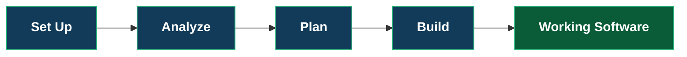
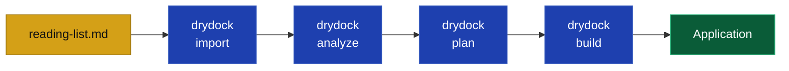

Drydock turns project specifications into working software. This guide builds a trivial
application to demonstrate the process.

The workflow follows the commands you run:



Drydock copies your specification material into a workpace, analyzes to create stories, plans to groom buildable blueprints, and then builds software.  Test driven development gates each step.  Drydock provides a web interface for control and observability.

## Before you begin

1) Setup a cli based LLM provider such as claude or codex in your `PATH`
2) Download drydock as per the [User Installation Guide](USER_INSTALLATION.md).

```bash
# Recommended — isolated tool install:
uv tool install drydock-sdd

#  Alternative with `pipx`:
pipx install drydock-sdd

# Or if you want to manually setup:
python -m pip install drydock-sdd
```

`uv tool` and `pipx` install Drydock in a dedicated environment and put a command wrapper on your `PATH`; they are the right choice for an interactive CLI. `pip` installs Drydock into whatever virtual environment is active and requires you to update your `PATH`.

3) Review your setup with

```bash
drydock --version
drydock config show
```

`config show` displays your setup - The two important directories are:

- **drydock_workspace**: Workspace for the drydock
- **drydock_build directory**: Parent Directory for applications

Drydock is scoped to work only in these directories.

## 1. Create Target Workspace

A **Target** is the name of the application you wish to build in ```$drydock_build_directory```.  Our example Target is named `ReadingList` and will deploy to `$drydock_build_directory/ReadingList`.

```bash
drydock init ReadingList             # Initialize project workspace
```

## 2. Give Drydock the product description

Create source specification material in a file (example: `reading-list.md`)

```markdown
# Reading List

Build a web application that keeps a list of books to read.

The reader can add a book with a title and author, view the books in the order added,
and remove a book. An empty title or author is rejected with a clear error message.

The application includes automated tests for each behavior.
```

Import the file you just created:

```bash
drydock import ReadingList ./reading-list.md
drydock score spec ReadingList                    # Optional
```

Perform an initial analysis on the material and review it.  Analyze turns the source material into stories, acceptance criteria, questions, and blockers.

```bash
drydock analyze ReadingList                                    # Create stories, criteria, and questions.
```

## 3. Review the analysis

```bash
drydock run quarterdeck ReadingList
```

Navigate to the Quarterdeck - the start page is listed on the Quarterdeck command above ( http://127.0.0.1:8080)

The quarterdeck contains several pages:

* Commanders Chair - Overview of status
* Compass - Your constitution
* Analysis - The stories and input Analysis
* Sea Trials - project acceptance criteria
* Blockers - **questions you must answer**
* Questionaires - like Discovery Identity and Stack Choices.

<figure style="margin: 1.5rem auto; text-align: center;">
  
  <figcaption><em>The Commander's Chair summarizes the analyzed stories, questionnaires, and blockers.</em></figcaption>
</figure>

<figure style="margin: 1.5rem auto; text-align: center;">
  
  <figcaption><em>The Analysis page shows the stories and high-level acceptance criteria created from the source material.</em></figcaption>
</figure>

## 4. Create Blueprint and Build Graph

```bash
drydock plan ReadingList      # Create the Blueprint and Manifest.
```

The plan or Agile Decomposition stage creates **Blueprint** files which are buildable specifications and the **Manifest** or dependency-aware build plan.  The Blueprints contain test driven development assertions.

```bash
drydock run quarterdeck ReadingList
```

In the quarterdeck you have access to
* The Manifest or Build Graph
* The Kanban Board
* Decisions - A Controllablel Log Of LLM Decisions
* Blueprints - Your Blueprints

From the quartedeck you can see the stages of the build and the details of each stage.  Drydock breaks the build into Blocks of similar work - foundational work, persistence work, services, and service consumers like UI Screens.

<figure style="margin: 1.5rem auto; text-align: center;">
  
  <figcaption><em>The Manifest groups related stories into build blocks and shows which work is ready or blocked.</em></figcaption>
</figure>

## 5. Build the application

```bash
drydock build ReadingList
```

The created application is in $drydock_build_directory/ReadingList/

```text
cd $drydock_build_directory/ReadingList/
```

Each application

Run it using the project instructions generated in that directory.

## What you just built



## Changing your example application

Add the following line to `reading-list.md`:

```markdown
The reader can mark a book as read and view whether
each book is unread or read.
```

The development change process within drydock is as follow:

```bash
drydock import ReadingList --update  # Re-import your specs
drydock refit ReadingList --sources  # Create Refit Tickets
                                     # Update the Manifest
drydock build ReadingList            # Incremental Build
```

The above is the development workflow and is designed for high velocity changes to your specifications.  Drydock compares updated source materials to previous versions, maps the change to the build graph, and rebuilds the affected work.

# References

[User Installation Guide](USER_INSTALLATION.md).
[Drydock Specification](Drydock_Specification.html).

---

Copyright © 2026 Web Cloud Studio.
