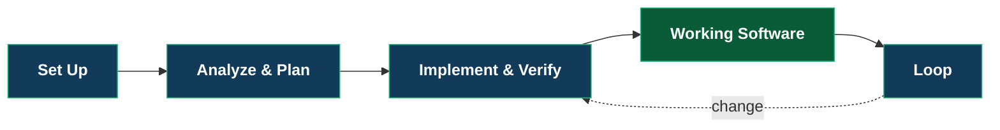
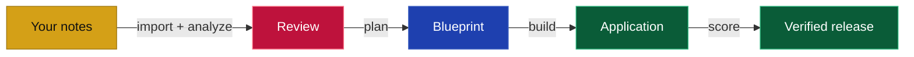

# Drydock Quick Start

Drydock turns your project specifications into working, tested software. This guide builds a small
reading-list application and shows where you review the work in the QuarterDeck.

The workflow is SAIL:



You provide the product intent and approve the decisions. Drydock creates the Blueprint, builds its
Manifest in dependency order, and verifies the result.

## Before you begin

This guide assumes Drydock and a supported subscription CLI are installed and authenticated. If
`drydock` does not run, follow the [User Installation Guide](USER_INSTALLATION.md).

Confirm the command and your saved configuration:

```bash
drydock --version
drydock config show
```

The configuration names two locations:

- the **workspace**, where Drydock keeps Targets, Blueprints, decisions, and evidence;
- the **build directory**, where Drydock writes the applications it builds.

## 1. Set up the Target

A **Target** is one application managed by Drydock. Create one named `ReadingList`:

```bash
drydock init ReadingList \
  --display-name "Reading List" \
  --description "A small application for tracking books to read."
```

Use `drydock status` whenever you need orientation. It reports the current state and the next useful
operation.

```bash
drydock status ReadingList
```

## 2. Give Drydock the product description

Create a directory named `reading-list-notes` containing one Markdown file:

```markdown
# Reading List

A reader keeps a list of books to read.

The reader can add a book with a title and author, view the books in the order added,
and remove a book. An empty title or author is rejected with a clear error message.

The application includes automated tests for each behavior.
```

Import the directory and analyze it:

```bash
drydock import ReadingList ./reading-list-notes --format markdown
drydock analyze ReadingList
```

Analyze turns the source material into stories, acceptance criteria, questions, and blockers. It
does not build the application.

## 3. Review the analysis

Open the QuarterDeck:

```bash
drydock run quarterdeck ReadingList
```

Review the proposed scope, answer open questions, and resolve blockers. Your answers become project
guidance for the next command. Running `plan` is the approval to proceed.

> **Recommended screenshot — Analyze:** show the QuarterDeck after `analyze`, with the project
> summary, story list, and one visible question or blocker. Crop out browser chrome and use the
> caption: *Review the stories and answer open questions before planning.*

## 4. Create the Blueprint

Create the specifications and executable build plan, then validate them:

```bash
drydock plan ReadingList
drydock validate ReadingList
```

The **Blueprint** is the source of truth for the product. The **Manifest** is its dependency-aware
build plan. Validation checks the Typed Specification structure without calling an LLM.

Return to the QuarterDeck to review the planned work:

```bash
drydock run quarterdeck ReadingList
```

You should now see what Drydock plans to build and which work is ready first.

## 5. Build the application

Build advances one runnable Manifest step at a time. The loop stops when all planned work is complete
or when a decision is needed.

```bash
while drydock status ReadingList --ready; do
  drydock build ReadingList
  drydock build status ReadingList
done
```

If the build stops before completion, open the QuarterDeck. It shows the failed or blocked work and
the action required from you.

> **Recommended screenshot — Implement:** show the QuarterDeck partway through the build, with
> completed work, the current frontier, and remaining work visible together. Caption: *Drydock builds
> the runnable frontier in dependency order.*

The finished application is under:

```text
$DRYDOCK_BUILD_DIRECTORY/ReadingList/
```

Run it using the project instructions generated in that directory.

## 6. Verify release readiness

Run the acceptance checks and the product-level release assessment:

```bash
drydock score ac ReadingList
drydock score release ReadingList
```

`score ac` executes the programmatic acceptance criteria. `score release` evaluates the completed
application against its Sea Trials and writes the release scorecard.

Open the QuarterDeck one final time:

```bash
drydock run quarterdeck ReadingList
```

Review failed checks before treating the application as complete.

> **Recommended screenshot — Verify:** show the final acceptance results and release scorecard in
> the QuarterDeck. Use a project with at least one meaningful criterion visible. Caption: *Acceptance
> results and Sea Trials provide the final release decision.*

## What you just built



| You supplied | Drydock produced |
|---|---|
| Product description | Analyzed stories and acceptance criteria |
| Answers and decisions | A Typed Specification Blueprint |
| Approval to proceed | A dependency-aware Manifest |
| Release judgment | Working software, evidence, and scores |

## Make the next change

The Blueprint remains the source of truth after the first release. Describe the change in a ticket
under the Target's `blueprint/changes/` directory, then run:

```bash
drydock refit ReadingList
drydock build ReadingList
drydock score ac ReadingList
```

Drydock maps the change into the Manifest and rebuilds the affected work.

## Keep these commands nearby

```bash
drydock status ReadingList                 # Where am I, and what is next?
drydock run quarterdeck ReadingList        # What needs my review or decision?
drydock build status ReadingList           # What is built, blocked, or ready?
```

For installation and configuration, see the [User Installation Guide](USER_INSTALLATION.md). For
the complete command contracts and artifact definitions, see the
[Drydock Specification](Drydock_Specification.html).
