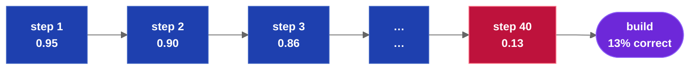

# Improving Step Accuracy in Specification-Driven Development

**Ed Barlow — Web Cloud Studio**

## Abstract

Specification-driven development (SDD) builds software from a written specification by executing
a sequence of LLM build steps. Two failure modes dominate: error compounds multiplicatively
across unverified steps, and model quality degrades as prompt context grows. This paper applies
classical engineering to both. Break the specification into small units of work by Agile Epic
decomposition. Put hard, executable tests on each unit. Relate the units in a graph database and
let test results gate the graph. Stack each build prompt from delimited specification blocks,
inject shared stack and branding rules once, and compress a specification to its contract after
its first use. The combination bounds every step, verifies every step, and makes the build
repeatable: the same specification produces the same working software.

**Keywords:** specification-driven development, LLM code generation, test-driven development,
Agile decomposition, graph database, prompt stacking, context compression

## 1. The Accuracy Problem

An LLM build is a chain of dependent steps. If each step is correct with independent probability
*p*, the chain is correct with probability *pⁿ*. At *p* = 0.95, forty steps deliver a correct
build less than 13% of the time.


*Unverified error compounds: each step multiplies the survival probability of the whole build.*

The second failure mode is independent of the first. Model accuracy is not constant in context
size. A 250,000-token specification fits inside a modern context window, but fitting is not
comprehension: as context grows, models increasingly miss constraints, conflate similar
sections, and weight material by position rather than relevance. The degradation is measured
and reproducible [4]. A build step prompted with the full specification therefore starts with a
lower *p* than the same step prompted with only the sections it needs — before any compounding
begins.

Both failure modes yield to the same classical engineering move: break the problem into smaller
chunks, put hard tests on each chunk, and surface missing information as questions instead of
guesses. The remainder of this paper is that method, as a series of simplifications.

## 2. Simplification #1: Agile Epic Decomposition

Software engineering already owns a decomposition method with twenty-five years of practice
behind it: the Agile Epic. The Epic decomposes into features; features decompose into stories.
The method is thoroughly documented, and — decisively for SDD — it is thoroughly represented in
LLM training data. The model does not need the method explained. It needs to be told to use it.

Applied to SDD, the specification is the Epic. Decomposition continues until every story is a
unit of work small enough to build in one bounded step. Each story carries three required
sections:

| Section | Contents |
|---|---|
| Behavior | What the story builds, stated against the specification |
| Acceptance criteria | Executable assertions that define done (§3) |
| Dependencies | The stories that must complete first (§4) |

A story that cannot be given honest acceptance criteria is not yet a story; decompose further.

Decomposition also exposes what the specification does not say. A correct decomposition method
returns missing information to the product owner as explicit questions and blocks planning until
a human answers. The mechanisms vary and are not specified here; the requirement is that
ambiguity is resolved by a person before it becomes code.

## 3. Simplification #2: Test-Driven Development for Story Quality

Test-driven development supplies the per-story quality discipline: write the test before the
code, and let the test — not the author — decide when the work is done.

Acceptance criteria are written at decomposition time as Pythonic, executable assertions:
concrete checks against files, routes, return values, and observable behavior. Prose criteria
("the import should work correctly") are not acceptance; an assertion that cannot be executed
cannot gate a build.

The criteria enter the build prompt as the step's explicit success condition, which changes the
task from interpreting an open-ended instruction to satisfying declared assertions — the regime
in which model output is most reliable. After the step, the same assertions run as ordinary
tests, outside the model. The model is never asked whether it finished. A model asked to grade
its own work gives a sincere, unreliable answer; an executed assertion gives a true one.


*Each story builds, then its declared assertions execute. Failure loops back; only a verified
story unlocks the next.*

## 4. Simplification #3: Relate Features and Stories in a Graph Database

Stories are not a list; they are a graph. Each story's dependency section defines edges; the
features and stories are nodes; the result is a graph database of the build, stored as plain
text alongside the specification.

The graph does three jobs:

1. **Ordering.** The runnable frontier — stories whose dependencies have all passed their
   tests — is computable by inspection. Build order is a property of the data, not a judgment
   the model makes mid-run.
2. **Gating.** A story runs only when everything it depends on has verified. A failed story
   blocks its dependents, so a defect is caught at the step that created it and repaired
   locally: fix one story, rerun one step.
3. **Containment.** With a test at every edge, no chain of unverified steps ever exceeds length
   one. The §1 arithmetic collapses from *pⁿ* to *p* per step — and §§2–3, 5–6 exist to raise
   that per-step *p*.

## 5. Stacking Specifications: Stack and Branding Rules

A build prompt is assembled, not written. Each step's prompt stacks the exact files the step
requires, each wrapped in an XML delimiter that names the file and its role:

```xml
<pblock filename="FEATURE-Import.md" role="implements">
  ...specification content...
</pblock>
<pblock filename="python.md" role="stack">
  ...stack rules...
</pblock>
```

The delimiters give the model an unambiguous map of what each block is and why it is present,
and they make prompt composition deterministic and auditable: the prompt for any step is a
computed function of the graph, reproducible byte for byte.

Shared material stacks the same way. An organization's stack rules (language, framework, and
platform conventions) and branding (palette, typography, document standards) are written once
and injected as delimited blocks into every step that needs them. Every project built this way
conforms to the same conventions with no per-project restatement — and no step ever receives
rules irrelevant to its technology.

## 6. Compression: Second Use Is the Contract

The first story that implements a specification file needs all of it. Every later story that
merely uses the result needs only the contract: routes, class names, method signatures, typed
parameters, one-line summaries. Rationale, examples, and internal design are implementation
detail — dead weight in a consumer's context.

Compression makes this mechanical. Each specification file gains a compact derivative
containing only its callable surface. The builder step stacks the full file, once; every
consumer step stacks the derivative. A database specification of several thousand tokens
compresses to a class-and-signature listing a fraction of the size, and every feature built on
top of it pays the small price, not the large one.

The effect is on both failure modes of §1: total context per step falls (raising per-step
accuracy), and the material that remains is exactly what the step consumes (removing the
confusable bulk).

## 7. Optimization: Repeatable Quality Builds

The pieces compose into an optimized, repeatable build:

| Piece | Contribution |
|---|---|
| Decomposition (§2) | Every step is small enough to be accurate |
| Tests (§3) | Every step proves itself before anything depends on it |
| Graph (§4) | Order is computed; errors are contained at edges |
| Stacking (§5) | Every prompt is a deterministic function of declared files |
| Compression (§6) | Every prompt carries contracts, not bulk |

Two optimizations fall out of the graph directly. Stories that share context — a common feature
file, the same stack rules — group into a single step, so the shared material is injected once
instead of once per story. And because every prompt derives from versioned files rather than
conversation history, a change to one specification file invalidates only the stories that
depend on it: the rebuild is the affected subgraph, not the application.

Repeatability is the sum. The specification, the graph, the tests, and the stacking rules fully
determine every prompt and every acceptance decision. Run the build again and the same inputs
produce the same verified software — which is the property that makes a specification worth
owning.

Drydock [1] is the reference implementation of this method.

## 8. Conclusion

This is classical engineering applied to a new build tool. Break the specification into stories
small enough to be accurate. Put a hard, executable test on every story. Relate the stories in
a graph and let the tests gate it. Stack every prompt from delimited, versioned blocks;
compress what is merely consumed; surface what is missing as questions for a human. Error stops
compounding, context stops confusing, and the build repeats.

## References

[1] E. Barlow. *Drydock Specification: Agile Specification-Driven Design — The SAIL Methodology
for Governed Software Delivery.* Web Cloud Studio, 2026.
https://github.com/webcloudstudio/Drydock

[2] K. Beck et al. *Manifesto for Agile Software Development.* 2001. https://agilemanifesto.org

[3] K. Beck. *Test-Driven Development: By Example.* Addison-Wesley, 2002.

[4] N. F. Liu, K. Lin, J. Hewitt, A. Paranjape, M. Bevilacqua, F. Petroni, and P. Liang. "Lost
in the Middle: How Language Models Use Long Contexts." *Transactions of the Association for
Computational Linguistics*, 12:157–173, 2024.
