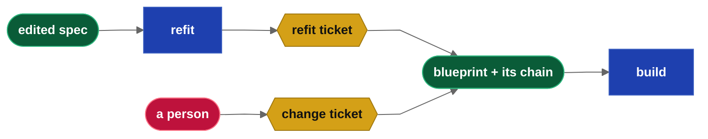

## Abstract

In specification-driven development the specification is the source of truth and the product is
generated from it.

This paper investigates the best process to modify applications after they are initially built.  Stable applications require change tickets but newly built applications require
significant testing and minor iteration of the specifications.

The user should not expect to perform a full rebuild of specification -> application for minor
changes like workflows and cosmetics and ui layouts.  New applications from specifications will require multiple change passes.

This paper investigates the optimal path to solve this problem.

**Keywords:** specification-driven development, change tickets, dependency graph, contracts, incremental build, blueprints, git

## The Problem

In drydock, user authored specifications go through a process.  `drydock import` copies specifications into a workspace.  `drydock analyze` (agile story decomposition) and `drydock plan` (agile grooming) build them into typed blueprints and create a graph database mapping metadata and dependencies. Every agile story is created as a blueprint file containing build information like description and definition of done/acceptance criteria.

These files are internal to the system and for mature systems should be considered canonical but for new systems they can be transitory.  The system could well be rebuilt from scratch.
The user should therefore only edit their source files. This has significant implications.

Any solution needs to handle the following workflow

  **1) The user Edits their Specifications**
  **2) The user reimports their Specifications into the workspace**
  **3) The system then analyzes the changes**
  **4) The system then implements the changes**

*The first pass. Everything right of the edit is produced, and on the second pass it is all
produced again.*

## 1. Your Specification Is the Source of Truth

### 1.1 The user edits one file, and it is theirs

The user writes the specification. The blueprints, the graph, and the code are all made from it.

Every other rule here exists to keep that true. The moment a user edits a blueprint there are two
specifications and no way to say which one the software came from.

### 1.2 The system works from a copy

Import copies the specification into the workspace and the build works from the copy. The original
stays where the user keeps it. The copy is what "before" means; without it there is nothing to
compare the next edit against.

Editing the specification starts nothing. The user re-imports when the edit is ready. That is the
save button, and the line between drafting and committing.

### 1.3 Rejected — Amend the Blueprint

The first design had the change edit the blueprint. The paragraph moved, so the blueprint written
from that paragraph moved to match. It is the obvious answer.

A blueprint is build output. A model wrote it, the build implemented it, a review passed it, tests
were written against it. Take a small application: one foundation, one database, twelve routes,
twelve screens. Twenty-six blueprints. Change one route and amend its blueprint. The file now
describes a route that was never built, and the screen above it was tested against wording that is
gone, overwritten, with nothing left to say it was ever the built version.

Repeat that daily and nobody can say which of the twenty-six match the running code.

**Editing a built artifact throws away the evidence that it was built.**

### 1.4 Solution — Append via a Refit Ticket

A refit ticket is a numbered story attached to one blueprint. It says what changed and what must
now be true. It does not restate the blueprint.

The blueprint is frozen. Nothing edits it, not a hand and not a model. Change is appended. The
current specification is the blueprint read with its tickets, in number order. Ticket three may
contradict ticket one, or the blueprint, and the later one wins.

That is how the user changes their mind in week three without touching anything from week one.

*The second pass. Analyze, plan, and the blueprints are not in it.*

### 1.5 Solution — Stop Only When a Contract Changes

Some changes cannot be a ticket, but fewer than it first appears. An edit to the foundation is not
automatically a rebuild. Rename a configuration value, add an index, raise a timeout, change a log
level — nothing was built against any of them.

A contract is what one blueprint promised another: the shape of a route, the columns of a table,
the arguments of a function. Move a contract and everything built on it is wrong, and no ticket can
carry that, because it would have to be written against every dependent at once. So the test is not
whether the foundation changed. It is whether a contract moved. If one did, stop, name the file,
and plan again.

**The contract is the dependency boundary, not the file.**

### 1.6 Solution — A Deletion Is Transitive, and Gated

An addition is local. Add a route and nothing else needs to know. Delete a route and the screen
that calls it, the link that reaches it, and the test that exercises it all break — and none of
those files changed. The map from specification to blueprint is not enough. The graph has to be
walked.

Walking it is mechanical. The edges already exist and a removed contract always reaches its
dependents, so no judgment is involved. A removal ticket lands on the owning blueprint and one
lands on each dependent the graph names. The blueprint itself is never deleted; it is the record of
what was built, and blueprint plus chain reads as: this route existed, then it did not.

Two guards. A file missing from a partial import was not deleted, it was not sent, so removal is
inferred only when the whole specification was compared. And when the deleted thing has users and
is not created again elsewhere, the removal waits for a person to approve it.

**Removal is the one change that walks the graph.**

### 1.7 Cutover to Blueprints

The specification is the source of truth while the application is still being decided. That ends.
When the application is stable the blueprints become the source of truth, and analyze and plan are
never run again.

This is a one-way door. Before cutover, a decision that lives only in a ticket is lost the next
time the project is planned. After cutover there is no planning to lose it, and the chain is the
history.

**Cutover is the day regeneration stops being cheap, so it is chosen, not discovered.**

## 2. Analysis, Planning and the Graph Must Be Preserved

### 2.1 What planning produced

Analysis breaks the specification into stories. Planning turns them into blueprints and a graph:
blueprints are nodes, dependencies are edges, stored as plain text beside the specification. Then
it is built and reviewed.

That work is expensive and not reproducible. Run planning twice on one specification and both
results are defensible and different. Preserving it is not an optimization; it is why a second pass
is possible at all.

### 2.2 Rejected — Ask the Model What Broke

The design before this one asked the model to rule on every story downstream of a change:
invalidate or retain, with a reason.

It reads well and cannot be checked. A wrong *retain* ships stale code that passes its old tests. A
wrong *invalidate* rebuilds working code for nothing. Neither is visible in the output, and both
cost most on the largest projects, where the downstream list is longest.

The ticket model has no such question in it. A ticket is a new story built in order, so nothing is
invalidated and nothing needs a ruling.

**The fix for an unanswerable question is a design that never asks it.**

### 2.3 Rejected — Merge the Tickets Back

Chains grow and folding them into the blueprint is tempting.

Before cutover there is no reason to. Merging a chain into a document is harder than writing the
document and less reliable. The specification is still authoritative, so re-import and plan again:
clean blueprints, no chain, and the same command that made them the first time.

After cutover there is nothing to plan from, so merging is not tidying up. It is rewriting the only
record of the build by hand, which is 1.3 arriving late.

**Cleanliness is the only argument for merging, and it is not enough.**

### 2.4 Solution — Only Planning Creates the Graph

The link from specification to blueprint is written down at plan time. Planning already knows it —
it read the specification and decided what each blueprint covers. Recording it then costs nothing
and turns "what did I just break" into a lookup.

One paragraph can feed two blueprints. When it does the change is split, and each ticket belongs to
exactly one blueprint. Nothing outside planning invents a node type or an edge; refit adds nodes to
a graph it did not design, in positions the graph already implies.

### 2.5 Solution — A Ticket Is an Ordinary Node

A ticket is a story. It has a state, dependencies, and acceptance criteria, so it builds, reviews,
and scores like every other story. Nothing new had to be written to run one.

Its edges are inherited, not computed. A child takes its parent's dependencies, so a ticket sits
where its blueprint sits and needs no wiring. Ticket one comes after the blueprint and after every
story that implemented it; ticket two comes after ticket one. One chain per blueprint, never run in
parallel. A later ticket can make an earlier one pointless, and there is no reliable way to detect
that, so the earlier one is applied anyway.

**Wasted work is cheaper than a wrong skip.**

### 2.6 Solution — Two Sources of Tickets, One Attachment Rule

Tickets come from two places. Refit writes them from a changed specification. After cutover a
person writes them directly, the way any team writes a change request.

They attach the same way. A ticket names one blueprint and joins that blueprint's chain: same node
class, same ordering, same inherited edges. The only difference is the author.

**Every node has a parent, so impact stays a lookup rather than a search.**

### 2.7 Solution — The Ticket Carries Its Tests

A change moves the contract. The tests written for that blueprint assert the old one, and they were
passing — reviewed evidence that the software was correct yesterday. So the ticket owns them. It
says which tests change and what they now assert, in the same document that says what the software
now does.

A test that fails after a change is evidence, not a verdict. It may have caught a defect, or it may
be doing exactly what it was written to do: failing when the behavior it locked in was deliberately
replaced. The user decides which, and can override the failure. A system without that override
refuses every change to tested behavior.

### 2.8 Solution — Give the Model One Job

The model writes prose. The code writes structure. Mixing the two is where these systems fail.

| Job | Done by |
|---|---|
| Say what changed and what must now be true | Model |
| Pick the ticket number and filename | Code |
| Attach the ticket to the right blueprint | Code |
| Record what the specification looked like at the time | Code |
| Check the ticket names a blueprint the map allows | Code |
| Decide to apply it | The user, by running the build |

A model that picks its own numbers will collide. A model that draws its own edges will draw the
wrong ones. Give it the one job it is good at and check its answer against the map.

## 3. Git History Discovers the Specification Diff

### 3.1 Solution — The Import Is the Save Button

The copy lives in git and the difference between two edits is a git diff. Nothing has to be mined
out of a model and no separate change log has to be kept in step.

The copy must be its own repository, and that has to be verified rather than assumed. A copy inside
a parent repository that also tracks it has two owners, and the diff you get depends on which one
you ask. Check at setup and refuse to start otherwise. Detection against the wrong tree is worse
than none.

### 3.2 Solution — Record the Commit ID and Checksum at Milestones

Every imported file gets a checksum and every import and build gets a commit id. Those are the
milestones: what the specification looked like when the copy was taken, and what it looked like
when the software was built. The checksum is per file, not per project, because one file can feed
several blueprints and each moves at its own pace.

**A checksum answers "has this changed" without reading anything.**

### 3.3 Solution — All or Nothing; the Rollback Is the Commit

A refit finishes or leaves nothing behind. Half a set of tickets is a broken graph with numbers
allocated to work that does not exist.

So the checksum advances only when the whole run commits. A failed run leaves no tickets and no
advanced checksum, and running it again does the entire job rather than the remainder. The commit
is the rollback.

## Solution

Freeze the blueprints. Keep the user in their own specification. Turn each edit into a numbered
ticket attached to the blueprint it changes, and build the tickets in order.

> Every decision goes back into the user's specification — until cutover, after which the
> blueprints hold it.

*Two sources of change, one chain, one build.*

## References

[1] E. Barlow. *Managing Changes in Specification-Driven Development.* Web Cloud Studio, 2026.

[2] E. Barlow. *Drydock Specification: Agile Specification-Driven Design — The SAIL Methodology for
Governed Software Delivery.* Web Cloud Studio, 2026.
https://github.com/webcloudstudio/Drydock
