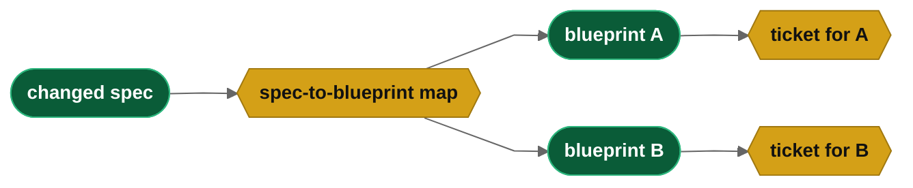

## Abstract

In specification-driven development the specification is the source of truth and the product is
generated from it.

This paper investigates initial build modifications.  These tend to result in a full rebuild of the
application from specifications and our goal is to manage costs and context for new projects.

New build are never quite correct.  There are numerous minor changes the developer will want at the
beginning of the project that do not require a complete change ticket cycle.

This paper solves the problem precisely and documents the solution Drydock implements.

**Keywords:** specification-driven development, source-driven refit, immutable blueprints, change
tickets, lineage, dependency graph

## The Problem

Drydock imports specifications into a workspace.  `drydock analyze` decomposes to stories and `drydock plan` builds
blueprints and a graph database around those stories.  Each blueprint is a story (or feature) with dependencies and
acceptance criteria and other information needed to build.

The user should not edit files which are generated or can be regenerated programatically.  The user will probably
feel most comfortable with their initial specification.  After an initial build, the original specifications authored
by the user should be rebuilt with any textual changes the user has made.

The solution needs to handle the following

  **1) Edits to The Users Specifications**
  **2) Updates of those specifications to our buildable blueprints and graph database**
  **3) Rebuilding from that update**

## What Does Not Work

**Rebuild everything.** This is rejected on cost. A full rebuild also discards working, reviewed, scored
code and reproduces it in a non deterministic manner requiring a full retest.

**Edit the Blueprint in place.** This makes the Blueprint, which is a build artifact, the source of truth and the authored
specifications a stale copy. It also destroys the property that matters most: that the product can be
regenerated from the authoritative source at any time.

**Mine the change out of the session.** Reading the LLM transcript for what changed produces slop.
A working session is exploration, dead ends, and thinking. See *Managing Changes in Specification-
Driven Development* [1] for that experiment and its failure.

## The Solution — Refit

Keep the specification the user wrote. Freeze the blueprints the build made from it. When the
specification changes, write down the change and build only the change.

Four rules do the whole job.

**1. The user edits their own file.** Nothing else is editable. The build copies the specification
when it imports it, and works from the copy. The original stays in the user's hands.

**2. Nothing moves until the user says so.** Editing the specification does not start a build. The
user re-imports when the edit is ready. That is the save button, and it is the line between drafting
and committing.

**3. Blueprints are frozen.** A blueprint is build output. It is never edited, not by hand and not
by a model. The only way to change one is to plan it again from the specification.

**4. The change becomes a numbered ticket.** Re-import compares the new specification to the old
copy, finds what moved, and writes one ticket per affected blueprint. The ticket says what the
change is and what must now be true. The build reads the blueprint plus its tickets, in number
order, and that is the current specification.

Rule 4 is the whole trick. Nothing gets rewritten. Things get appended.

*You edit the spec. Import copies it. Refit writes the ticket. Build applies it.*

## What Gets Built

Only the tickets. The blueprints were already built, reviewed, and scored. That work stands.

Each blueprint carries a list of its tickets in order. Ticket 1 runs after the blueprint. Ticket 2
runs after ticket 1. A ticket may contradict the blueprint or an earlier ticket, and the later
ticket wins. That is how the user changes their mind in week three without going back to edit
week one.

*The blueprint plus its tickets, in order, is the current spec. Nothing is edited.*

A ticket is just another story in the graph. It has a state, dependencies, and acceptance criteria,
so it builds, reviews, and scores like everything else. No new machinery is needed.

## Knowing Which Blueprint to Change

The build has to know which blueprints came from which part of the specification. Otherwise a change
is a search problem, and search means guessing.

So the mapping is recorded when the blueprints are planned. Planning already knows this: it read the
specification and decided what each blueprint covers. Writing that link down at plan time costs
nothing and turns "what did I just break" into a lookup.

One paragraph of specification can feed several blueprints. When it does, the change is split so
each ticket belongs to exactly one blueprint. A ticket never spans two.

*One edit, two blueprints, two tickets. The map is written at plan time, not guessed at change time.*

## What the Model Writes and What the Code Writes

The model writes prose. The code writes structure. Mixing the two is where these systems fail.

| Job | Done by |
|---|---|
| Say what changed and what must now be true | Model |
| Pick the ticket number and filename | Code |
| Attach the ticket to the right blueprint | Code |
| Record what the spec looked like at the time | Code |
| Check the ticket names a blueprint the map allows | Code |
| Decide to apply it | The user, by running the build |

A model that picks its own numbers will collide. A model that draws its own dependencies will draw
the wrong ones. A model that decides which blueprint a change belongs to will pick a plausible one.
Give it the one thing it is good at — writing the change down clearly — and check its answer against
the map.

## The Rules That Keep It Honest

**All or nothing.** A refit either finishes or leaves no trace. Half a set of tickets is a broken
build, and the next run would skip numbers. On failure, nothing is written and nothing is marked as
seen, so running it again does the whole job.

**Foundation changes are not refits.** Some specifications are context for everything — the
architecture, the data model, the platform rules. A change there really does invalidate the whole
build, and a ticket cannot express it. That case stops and says so, by name, and asks for a replan.
Pretending a foundation change is a small edit is the one failure this method must not allow.

**A deletion is a question, not an answer.** If a section disappears from the specification, that
might mean the feature is gone, or it might mean the user only sent part of the file. The build
never guesses and never deletes on its own. It asks, and records the answer in the ticket.

**Old tickets still run.** A later ticket may make an earlier one pointless. There is no reliable
way to detect that, so the earlier one is applied anyway. Some wasted work is cheaper than a wrong
skip.

## Starting Over Is Cheap

Tickets are never merged back into the blueprint. Merging is harder than planning and less reliable.

When the chain gets long, or when it is simply time, re-import the specification and plan it again.
The result is clean blueprints and no tickets. That is the reset, it is always available, and it is
the same command that made the blueprints the first time.

Because the reset is cheap, the tickets are disposable. Nothing warns about how many there are and
nothing nags the user to clean up. It sorts itself out.

One rule makes the reset safe:

> Every decision goes back into the user's own specification. Nothing lives only in a blueprint or
> a ticket.

Break that and the reset destroys work, because replanning would drop decisions written nowhere
else. Keep it and the whole ticket chain can be thrown away at any moment.

## Result

| | Before | After |
|---|---|---|
| A one-line spec change | Full rebuild | One ticket |
| Blueprints | Rewritten on every change | Written once |
| Finding the impact | Read everything and guess | Look it up |
| Foundation change | Looks like a typo | Stops and asks for a replan |
| A failed run | Half-built | Nothing written |
| Cleaning up | Merge tickets back | Re-import and plan again |

The specification is still the source of truth. The change to the method is small: a change to the
specification no longer rebuilds the product. It adds a numbered ticket to a frozen blueprint, and
the build applies the tickets in order.

## References

[1] E. Barlow. *Managing Changes in Specification-Driven Development.* Web Cloud Studio, 2026.

[2] E. Barlow. *Drydock Specification: Agile Specification-Driven Design — The SAIL Methodology for
Governed Software Delivery.* Web Cloud Studio, 2026.
https://github.com/webcloudstudio/Drydock
